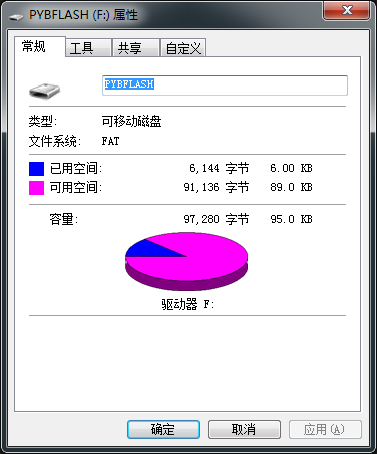
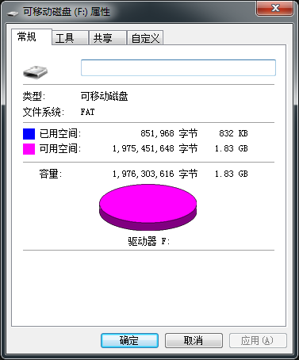

# os（"操作系统"基础服务）

os 模块包含文件系统的访问、加载、终端重定向、复制以及 `uname` 和 `urandom` 函数等功能。

## 文件系统

和 Linux 一样，MicroPython 将 "/" 做为文件系统的根目录，其它物理储存器都是挂载在根目录下。目前支持:

* `/flash` : 内部 flash 文件系统
* `/sd` : SD 卡文件系统 (如果存在)

pyboard在启动时，如果没有插入SD卡，当前目录就是 /flash，否则是 /sd。除了上面两个基本文件存储器，还可以通过 SPI/I2C 挂载新的的文件系统，比如将 eeprom 或 flash 挂载为文件系统，用户挂载的文件系统可以使用任意满足命名规范的名称。


## 一般函数

- os.`uname`()

  返回包含硬件和操作系统信息的元组。元组具有以下顺序的五个字段，每个字段都是一个字符串：

  - `sysname`，系统的名称。
  - `nodename`，网络名称（可以与sysname相同）。
  - `release`，系统的版本。
  - `version`，MicroPython版本和构建日期。
  - `machine`，底层硬件（如开发板、CPU）的标识符。
<br><br>

- os.`urandom`(n)

  返回 n 字节随机内容的 bytes 类型对象。在可能情况下它是由硬件生成的。
<br><br>    

## 访问文件系统

- os.`chdir`(path)

  改变当前目录。
<br><br>

-  os.`getcwd`()

  获取当前目录。
<br><br>

- os.`ilistdir`([dir])

  此函数返回一个迭代器，迭代器生成与它所列出的目录中的条目相对应的元组。在没有参数的情况下，它会列出当前目录，否则它会列出 `dir` 给定的目录。

  元组的形式为 (name, type, inode[, size]):
  - `name` 是一个代表文件名的字符串（如果dir是字节对象，则为字节）；
  - `type` 是一个指定类型的整数，0x4000表示目录，0x8000表示常规文件；
  - `inode` 是一个与文件的inode相对应的整数，对于没有这样一个索引节点的文件系统，它可能是0。
  - 一些硬件可能会返回一个包含大小的4元组。对于文件，size是一个表示文件大小的整数，如果未知，则为-1。目前，对于目录的定义尚未明确。

  如：
  ```
  >>> d=[f for f in os.`ilistdir`('')]
  >>> d
  [('boot.py', 32768, 0, 322), ('main.py', 32768, 0, 501), ('pybcdc.inf', 32768, 0, 2597), ('README.txt', 32768, 0, 526), ('System Volume Information', 16384, 0, 0), ('SKIPSD', 32768, 0, 0)]
  ```
<br><br>

- os.`listdir`([dir])

  无参数时列出当前目录文件，否则列出指定目录的文件。
<br><br>

- os.`mkdir`(path)

  创建新目录。
<br><br>

- os.`remove`(path)

  删除一个文件。
<br><br>

- os.`rmdir`(path)

  删除目录。
<br><br>

- os.`rename`(old_path, new_path)

  文件改名。
<br><br>

- os.`stat`(path)

  获取文件或目录状态，可以用于获取文件大小。
<br><br>

- os.`statvfs`(path)

  获取文件系统状态。返回参数是包含文件系统下面信息的元组:

  - f_bsize – 文件系统块大小。
  - f_frsize – 段大小。
  - f_blocks – 文件系统大小，以 f_frsize 数量计算。
  - f_bfree – 剩余块数量。
  - f_bavail – 非特权用户剩余块数量。
  - f_files – 节点数量。
  - f_ffree – 剩余节点数。
  - f_favail – 非特权用户剩余节点数。
  - f_flag – mount 标志位。
  - f_namemax – 文件名最大长度。

  节点参数: f_files, f_ffree, f_avail 和 f_flag 可能会是 0，因为在一些移植版本中还没有实现这些功能。

  利用 os.`statvfs`() 函数可以获取磁盘的大小和剩余空间，例如：
		
  ```
  >>> d=os.statvfs('/flash')
  >>> d
  (4096, 4096, 2043, 2033, 2033, 0, 0, 0, 0, 255)
  >>> disksize=d[0]*d[2]
  >>> diskfree=d[0]*d[3]
  >>> disksize, diskfree
  (8368128, 8327168)
  ```

- os.`sync`()

  同步所有文件系统。
<br><br>


## 终端重定向和复制

- os.`dupterm`(stream_object, index=0, / )

  复制或切换 micropython 的终端（REPL）到 `stream` 对象。`stream_object` 参数必须是本地流对象，或者从 `io.IOBase` 派生并实现了 `readinto()` 和 `write()` 方法。流应处于非阻塞模式，如果没有可供读取的数据，`readint()` 将返回 `None`。

  调用此函数后，所有终端输出都复制到这个 `stream`，而 `stream` 任何输入都会传递给终端输入。

  `index` 参数是一个非负整数，并指定要设置复制的插槽。可以使用多个插槽（插槽 0 将始终可用），并且在这种情况下，终端输入和输出将复制到所设置的所有插槽。
	
  如果传递 `None` 参数到 `stream_object`，将取消 `index` 的插槽。该函数返回给定槽中的前一个 `stream-like` 的对象。

## 挂载文件系统

  以下函数和类已移至 `vfs` 模块。os 模块中提供它们仅用于向后兼容性，并将在 MicroPython 版本2 中删除。详细说明请参考 `vfs` 模块中的说明。

  - os.`mount`(fsobj, mount_point, *, readonly)
  - os.`umount`(mount_point)
  - class os.`VfsFat`(block_dev)
  - class os.`VfsLfs1`(block_dev, readsize=32, progsize=32, lookahead=32)
  - class os.`VfsLfs2`(block_dev, readsize=32, progsize=32, lookahead=32, mtime=True)
  - class os.`VfsPosix`(root=None)

## os 函数的使用方法

- 列出文件和目录
```py
>>> import os
>>> os.listdir()
['1.txt', 'boot.py', 't1.py', 't2.py', 't0.py']
>>> os.listdir('/flash')
['main.py', 'pybcdc.inf', 'README.txt', 'boot.py', 'hello.txt', '1.py']
```

- 改变目录
```py
>>> os.getcwd()
'/sd'
>>> os.chdir('/')
>>> os.listdir()
['flash', 'sd']
```

- 创建目录
```py
>>> os.mkdir('/sd/dat')
>>> os.listdir('/sd')
['1.txt', 'boot.py', 't1.py', 't2.py', 't0.py', 'dat']
```

- 查看文件状态
```py
>>> os.listdir()
['main.py', 'pybcdc.inf', 'README.txt', 'boot.py', 'hello.txt', '1']
>>> os.stat('hello.txt')
(32768, 0, 0, 0, 0, 0, 32, 0, 0, 0)
>>> os.stat('main.py')
(32768, 0, 0, 0, 0, 0, 34, 546532106, 546532106, 546532106)
```

- 查看文件系统状态
```py
>>> os.statvfs('/sd')
(32768, 32768, 60312, 60286, 60286, 0, 0, 0, 0, 255)
>>> os.statvfs('/flash')
(512, 512, 190, 178, 178, 0, 0, 0, 0, 255)
```

可以通过 statvfs 计算磁盘空间。

例如，根据上面返回的参数计算，内部 Flash 空间的大小是：

  `512 x 190 = 97280 (bytes)`

剩余空间大小是：

  `512 x 178 = 91136 (bytes)`


通过资源管理器可以看到磁盘空间是：



microSD 卡总空间大小是：

  `32768 x 60132 = 1976303616 (bytes)`

剩余空间大小是：

  `32768 x 60286 = 1975451648 (bytes)`


