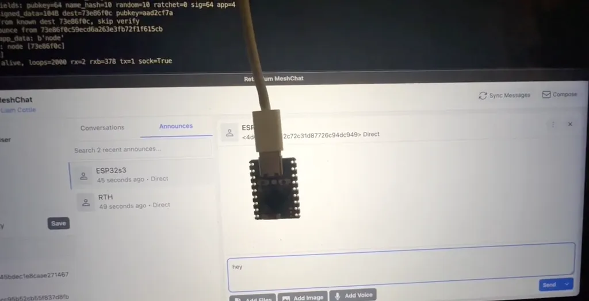

# µReticulum

[Reticulum](https://reticulum.network/index_zh-cn.html) 是一个基于密码学的网络栈。人们可以用现有的硬件设备基于 Reticulum 搭建本地或是广域的网络。Reticulum 就算是在极高延迟与极低带宽的情况下仍旧可以运行。Reticulum 的愿景是让任何人都能够搭建自己的通讯网络——用独立、互联、自治的网络覆盖广阔地域从未如此简单而廉价。

µReticulum 是针对 ESP32 微控制器的 Reticulum 网络栈的纯 MicroPython 实现，μReticulum 节点在 MeshChat、Sideband 和 NomadNet 中作为标准对等节点出现。完整的 LXMF 消息支持：发送和接收加密、签名的消息，并附有送达收据。



## 项目结构

```
ureticulum/
├── example_node.py          # LXMF messaging node with NeoPixel control
├── example_nomadnet_node.py # NomadNet page-serving node
├── config.py                # Node configuration (WiFi, interfaces)
├── urns/
│   ├── __init__.py          # Package entry point
│   ├── const.py             # Protocol constants (matching reference RNS)
│   ├── reticulum.py         # Core initialization, config, async event loop
│   ├── identity.py          # Identity management, key generation, announce validation
│   ├── destination.py       # Destination addressing, encryption, announce sending
│   ├── packet.py            # Packet framing, proof generation, receipts
│   ├── transport.py         # Packet routing, announce handling, interface management
│   ├── link.py              # Server-side Reticulum Links (ECDH handshake, request/response)
│   ├── lxmf.py              # LXMF message format, LXMessage, LXMRouter
│   ├── umsgpack.py          # Minimal MessagePack (subset needed for LXMF)
│   ├── log.py               # Logging with configurable verbosity
│   ├── interfaces/
│   │   ├── __init__.py      # Base Interface class
│   │   ├── udp.py           # WiFi UDP with broadcast discovery
│   │   ├── tcp.py           # HDLC-framed TCP client (for RNS transport servers)
│   │   ├── serial.py        # HDLC-framed UART (RNode, LoRa, ESP-to-ESP)
│   │   └── lora.py          # SX1262 SPI LoRa with RNode-compatible split framing
│   └── crypto/
│       ├── x25519.py        # X25519 ECDH key exchange
│       ├── ed25519.py       # Ed25519 signing/verification
│       ├── aes.py           # AES-128/256-CBC encryption (via ucryptolib)
│       ├── hkdf.py          # HKDF key derivation
│       ├── hmac.py          # HMAC-SHA256
│       ├── hashes.py        # SHA-256 (via uhashlib), SHA-512 (pure Python)
│       ├── sha512.py        # SHA-512 (pure Python for Ed25519)
│       ├── pkcs7.py         # PKCS7 padding
│       ├── token.py         # Fernet-style token encryption
│       └── pure25519/       # Curve25519 field arithmetic
│           ├── _ed25519.py
│           ├── basic.py
│           ├── ed25519_oop.py
│           └── eddsa.py
```

## 消息流（MeshChat → ESP32）

```
MeshChat                          ESP32-S3 (µReticulum)
   │                                    │
   ├─ LXMF announce ──────────────────► │ Validates Ed25519 signature
   │                                    │ Stores peer identity & display name
   │                                    │
   │ ◄────────────────── LXMF announce ─┤ Sends own announce (+ periodic re-announce)
   │ Peer appears in                    │
   │ network visualizer                 │
   │                                    │
   ├─ Encrypted LXMF message ────────► │ X25519 ECDH decrypt
   │  (e.g. "green")                    │ Unpack msgpack payload
   │                                    │ Verify Ed25519 signature
   │                                    │ Set NeoPixel color / echo reply
   │                                    │
   │ ◄──────────────── Delivery proof ──┤ Sign packet hash with Ed25519
   │ Shows "delivered"                  │ Send PKT_PROOF back
   │                                    │
   │ ◄────────── Echo reply (LXMF) ────┤ Encrypt + sign reply message
   │ Receives "Echo: green"            │ Send via opportunistic delivery
   │                                    │
```

## 相关链接

- [github 代码仓库](https://github.com/varna9000/micropython-reticulum)
