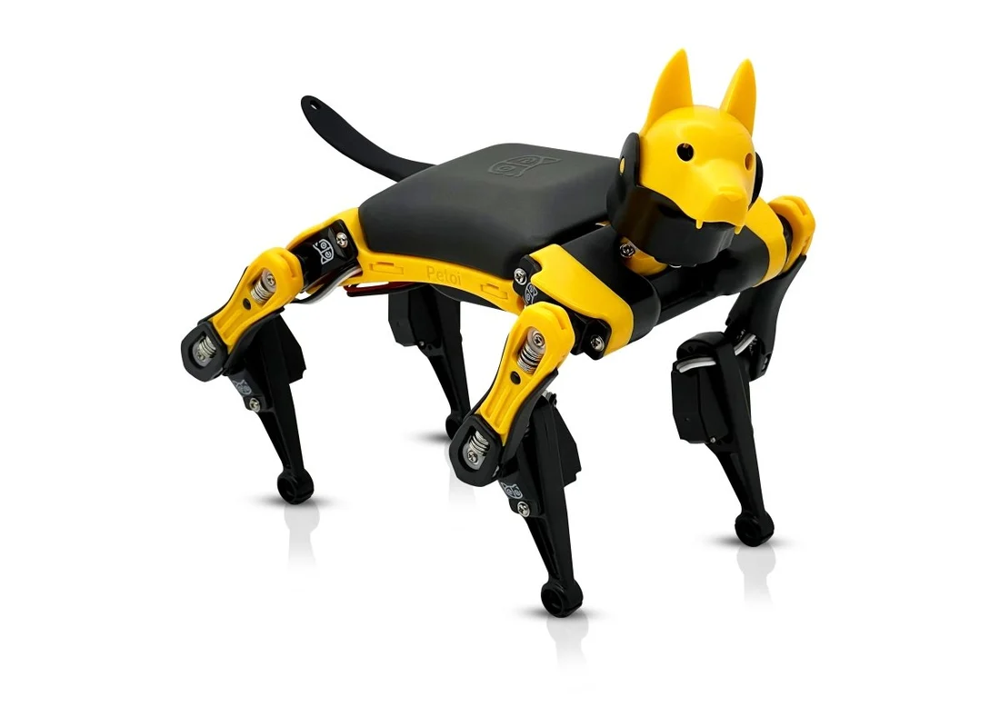

# 智能步态仿生机器狗 Petoi

开源的书桌机器人狗，支持 C++、MicroPython 和图形化编程。

## 相关链接

- [网站](https://www.petoi.com/)
- [hackster](https://www.hackster.io/news/petoi-s-quaddle-is-a-tiny-foldable-smart-introduction-to-microcontroller-powered-robotics-a1fe6dd43bf5)
- [kickstarter](https://www.kickstarter.com/projects/petoi/quaddle-open-source-desktop-robot-kit/description)
- [github](https://github.com/PetoiCamp)
