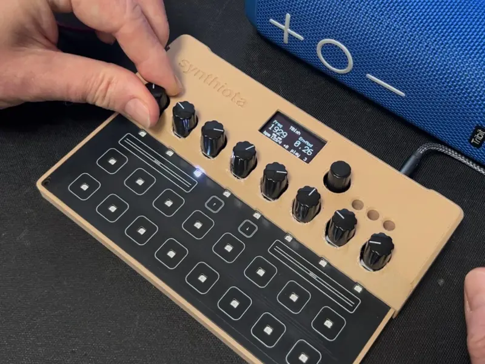
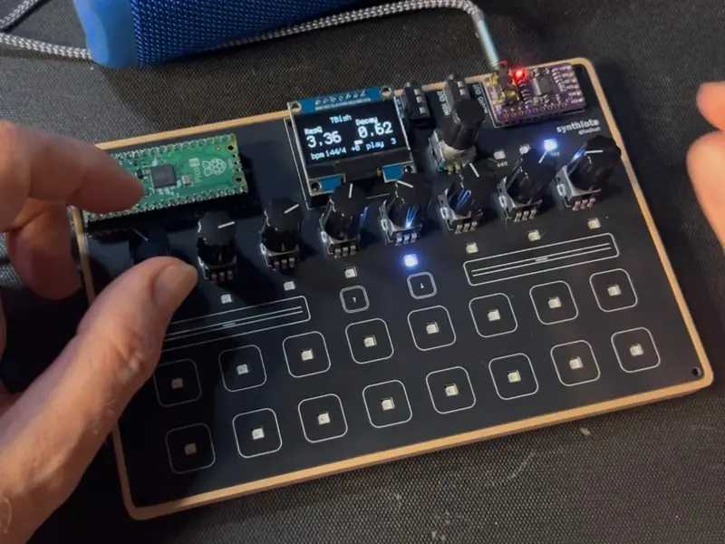
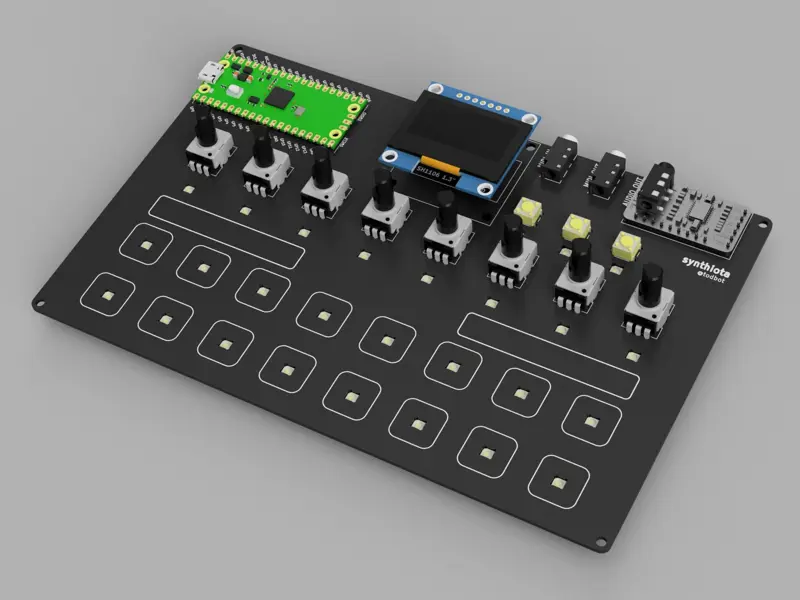

# CircuitPython中的Synthiota合成器套件 – SmallRun

专为CircuitPython设计的合成器，配备27个RGB LED、16个触控板、2个触控滑块、8个电位仪、MIDI输入/输出、高质量16位音频输出以及一个OLED显示屏，由Pico或Pico2驱动。

## 相关链接
- [网站](https://smallrun.net/shop/todbot/synthiota-kit)
- 演示视频
  - demo2: https://youtu.be/MjE2wdevc3M
  - demo1: https://youtu.be/O4a5pk78DVM
- 库和项目代码
  - https://github.com/relic-se/CircuitPython_Synthiota
  - https://github.com/relic-se/CircuitPython_Synthiota_DrumMachine
- [文档](https://github.com/todbot/synthiota/)
