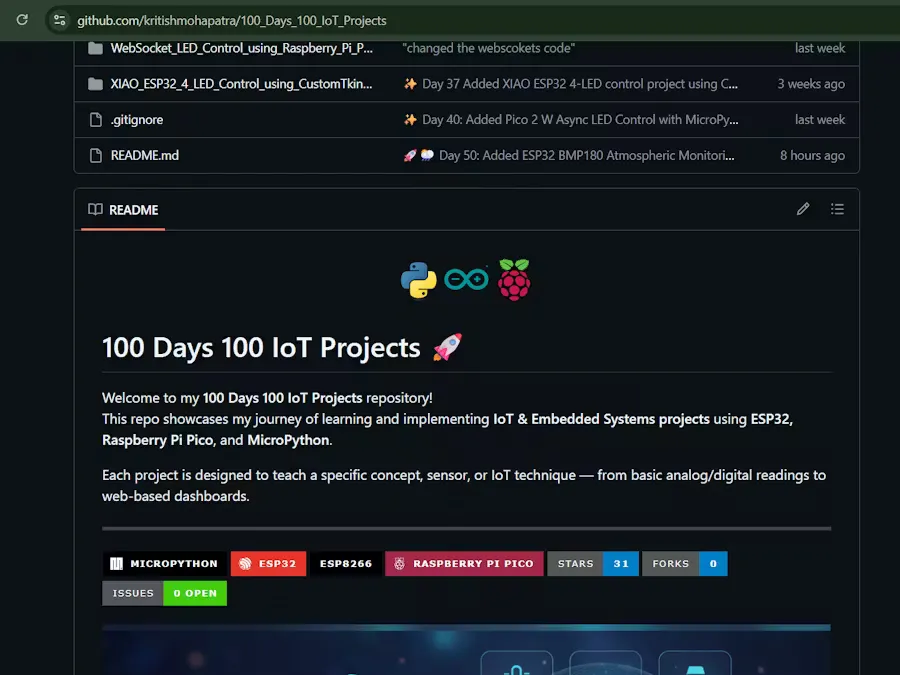

# 100 天，100 个物联网项目

“100 天，100 个物联网项目”项目是一个基于项目的学习路线图，涉及嵌入式系统和使用 MicroPython 开发物联网。其目标是系统地记录硬件项目，使学生和初学者能够学习从基础 GPIO 编程到高级无线物联网项目的结构化课程。

## 本项目中使用的物品

- Espressif ESP32
- Raspberry Pi Pico W
- NodeMCU ESP8266

## 软件应用程序和在线服务

- MicroPython
- [ThingSpeak API](https://www.hackster.io/thingspeak/products/thingspeak-api?ref=project-7e3065)
- [Blynk](https://www.hackster.io/blynk/products/blynk?ref=project-7e3065)

## 相关链接

- [hackster 说明](https://www.hackster.io/kritishmohapatra06norisk/100-days-100-iot-projects-with-micropython-7e3065)
- [项目仓库](https://github.com/kritishmohapatra/100_Days_100_IoT_Projects)

