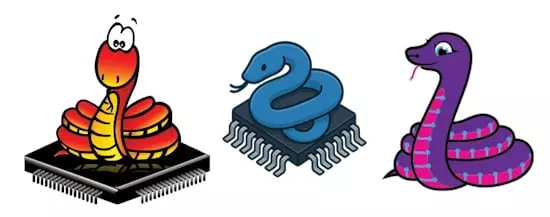

# pymcu-micropython

**PyMCU项目🐍⚡**

PyMCU是一个开源的实验性AOT（提前）编译器，它将Python的安全子集直接转换为微控制器的纯粹、高度优化的汇编（ASM），旨在通过零成本抽象（ZCA）实现确定性、裸机执行。

- **设计确定性**：无操作系统，无垃圾回收器。
- **透明和教育**：没有黑匣子。看看你的Python代码在汇编级别会变成什么，使其非常适合学习和高性能嵌入式系统。
- **生态系统就绪**：为嵌入式约束量身定制的内置标准库。
- **MIT 许可**。

目前已经发布了 AVR alpha 版，后续将扩展到 ARM Cortex-M。



pymcu-micropython 是 PyMCU 的 MicroPython 标准库。

## 这是什么？

`pymcu-microython`是一个插入式兼容层，允许使用熟悉的 micropython API（`machine`、`utime`、`microython`模块）编写固件，同时使用 PyMCU 将其编译为裸机代码。所有类和函数都实现为零成本抽象（ZCA）：它们被标记为`@inline`，这样就不会引入SRAM实例结构、堆栈帧和解释器开销 —— 编译器在编译时解析所有内容。

## 模块

| Module | 	MicroPython 等效 	| 说明 |
| --- | --- | --- |
| `machine` | `machine` | `Pin`, `UART`, `ADC`, `PWM`, `SPI`, `I2C`, `Timer`, `WDT`, `Signal` |
| `utime` | `utime` / `time` | `sleep_ms()`, `sleep_us()`, `sleep()`, `ticks_ms()`, `ticks_us()`, `ticks_diff()`, `ticks_add()` |
| `micropython` | `micropython` | `const()`, `@native`, `@viper` |

## 安装
```bash
pip install pymcu-micropython
```

## 快速开始

API 有意与 MicroPython 相同，因此现有的 MicroPython 程序无需修改即可工作：

```python
from machine import Pin
from utime import sleep_ms

def main():
    led = Pin(13, Pin.OUT)   # Arduino Uno built-in LED (D13 = PB5)
    while True:
        led.value(1)
        sleep_ms(500)
        led.value(0)
        sleep_ms(500)
```

然后通过 PyMCU 编译和写入

```
pymcu build
pymcu flash
```

## 硬件支持

目前提供以下引脚映射支持：

- **Arduino Uno**（ATmega328P）

可以通过在 `src/pymcu_micropython/boards` 下贡献一个文件来添加其他开发板。

## 相关链接

- [github 仓库](https://github.com/PyMCU/pymcu-micropython)

