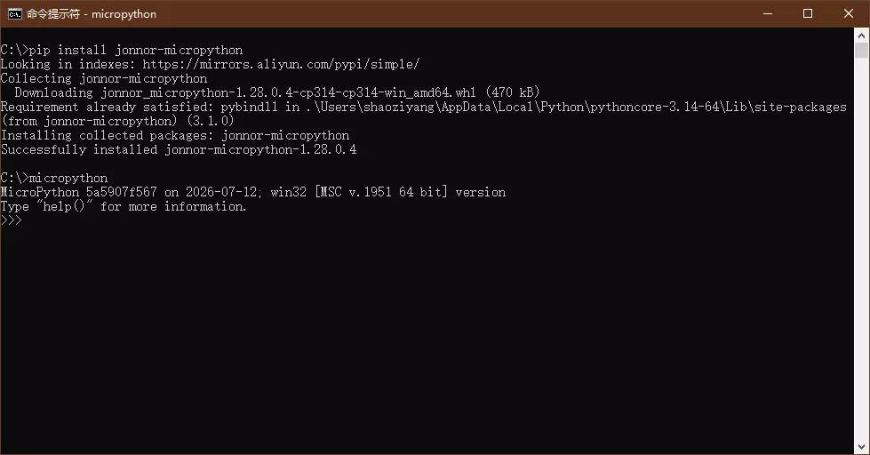
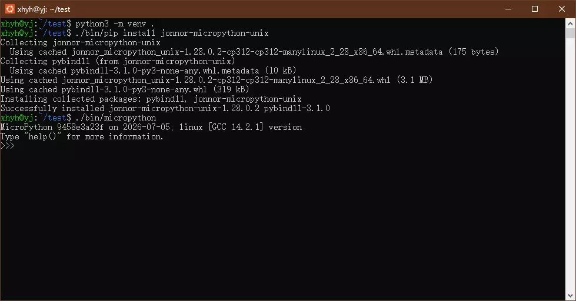
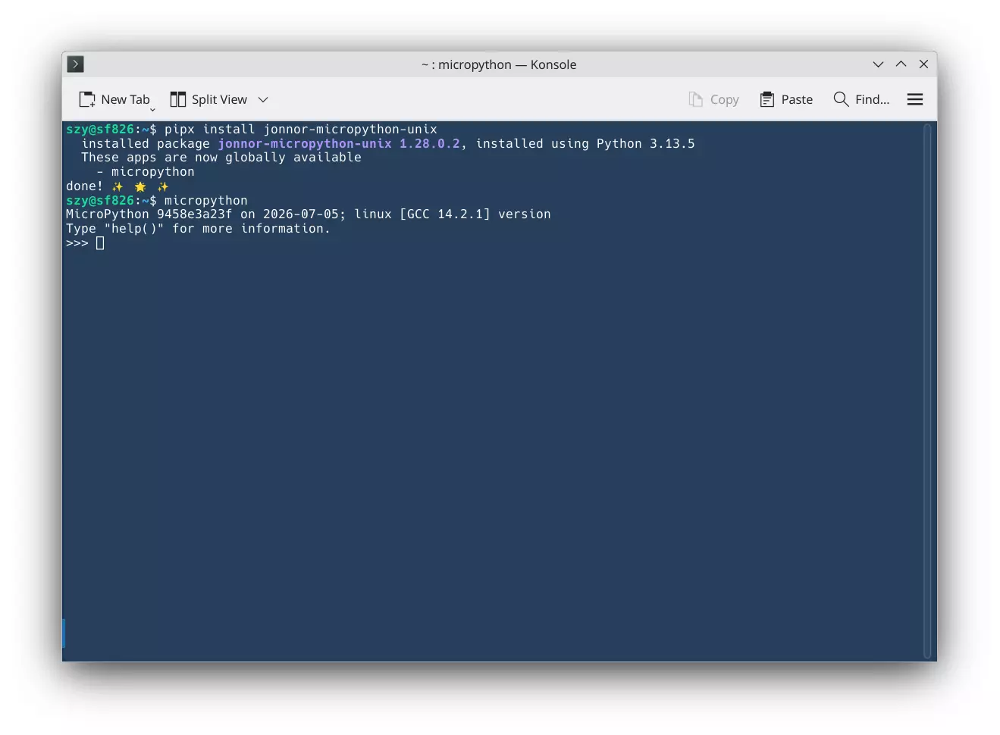

# 通过 pip 安装 micropython

现在可以在 PC 上通过 python 的包管理器 pip 直接安装 windows/linux 移植版本的 micropython。

首先需要安装 python 以及 python 的包管理器 pip （通常会随着 python 一起安装）。

## windows 
在 command/powershell 命令行界面下，输入下面命令：

```bash
pip install jonnor-micropython
```

等待安装完成后，就可以运行 micropython。



## Linux

在 Linux 或者 WSL 下，可以输入下面命令进行安装：

```bash
pip install jonnor-micropython-unix
```

有些 Linux 发行版不允许直接通过 pip 安装，但是可以用 `pipx` 进行安装，或者通过 uenv 创建一个虚拟环境安装。




