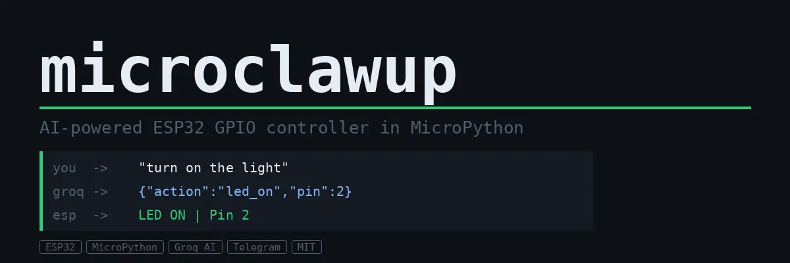

# microclawup

基于 MicroPython 的 AI 驱动 ESP32 GPIO 控制器。通过 Telegram 以自然语言控制您的硬件 — 由 Groq AI 提供支持。

例如：
```
"turn on the light"  ->  LED ON | Pin 2
"blink 5 times"      ->  Blink x5 | Pin 2
"pin 4 high"         ->  GPIO HIGH | Pin 4
```



## 工作原理

在 Telegram 上发送自然语言消息。Groq AI 会将其转换为 JSON 硬件命令。ESP32 执行并应答。

## 特点

- 自然语言GPIO控制 — 英语和印地语均可用
- 持久内存 — 重启后引脚状态得以保存
- `/status` 命令 — 随时查看所有引脚状态
- `/help` 命令 — 查看所有可用命令
- WiFi自动重连 — 即使WiFi断开，机器人也能保持在线
- 轻量级 — 在搭载 MicroPython 的ESP32上运行流畅

## 相关链接

- [项目仓库](https://github.com/kritishmohapatra/microclawup)
