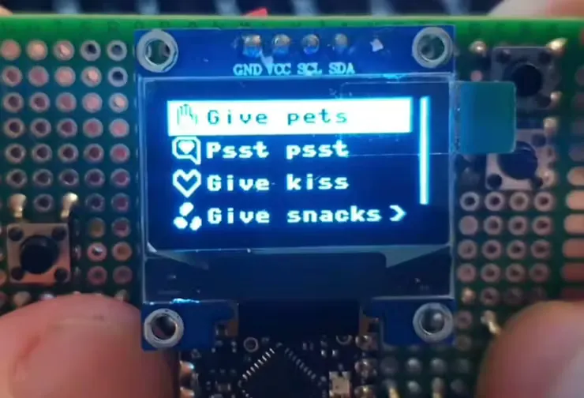
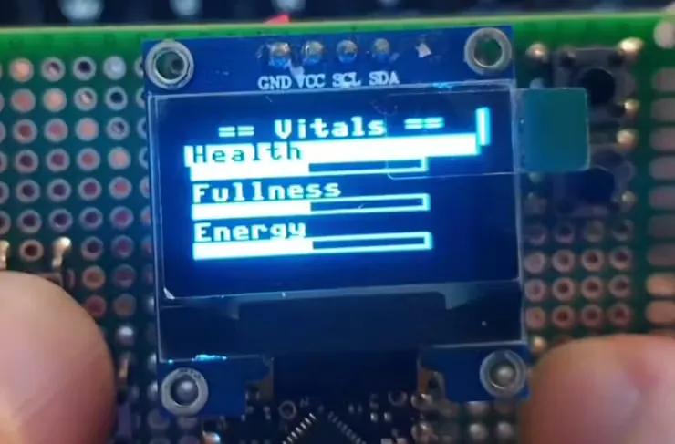

# 创建属于你的虚拟电子宠物

使用了 ESP32-C6 Super Mini 开发板、一块 SSD1306 128×64 OLED 显示屏和八个基本按钮，在用 MicroPython 编程就可以创建一个属于你的虚拟电子宠物，玩家的任务是照顾猫咪的健康，类似于 1990 年代流行的电子宠物。

## 相关链接

- [hackster 项目说明](https://www.hackster.io/news/how-to-create-your-own-handheld-virtual-pet-5378c7050d3c)
- [github 仓库](https://github.com/moonbench/catode32)
