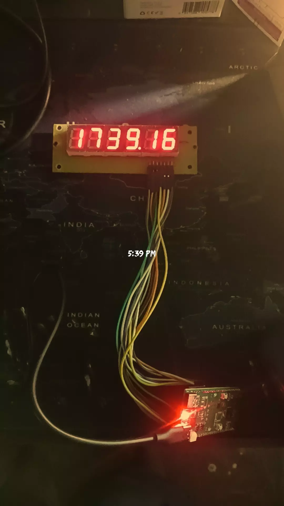
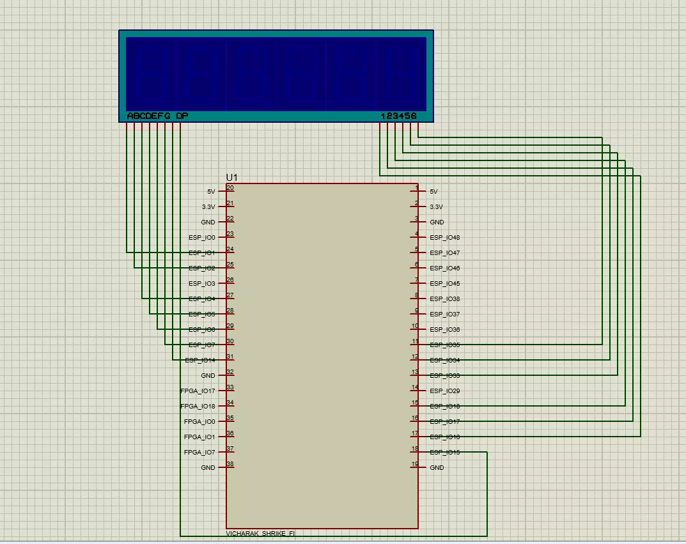

# 史莱克时钟

基于MicroPython的数字时钟，构建在公共阳极6位7段数码管上，由Vicharak Shrike Fi（ESP32-S3）开发板驱动。使用NTP通过WiFi实时同步，并在时间和日期显示之间自动切换。

**特点**

- 共阳数码管（8段+6位）的多路驱动器
- WiFi连接 + NTP时间同步（每1小时自动重新同步一次）
- 可配置的时区偏移（默认：IST，UTC+5:30）
- 开机追逐动画
- 自动切换：在循环中显示时间（HH:MM:SS，冒号闪烁）8秒，然后显示日期（DD.MM.YY）2.5秒
- 无闪烁连续多路复用（无阻塞设计）

**电路图**

**相关链接**

- [github仓库](https://github.com/kritishmohapatra/ShrikeClock)
