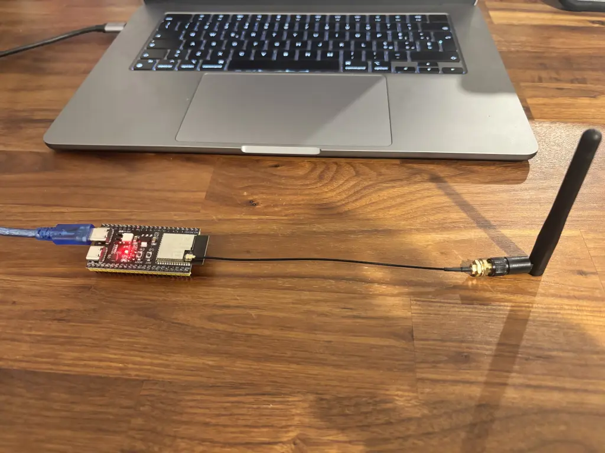

# 基于 ESP32 的人体传感器  ESPectre

基于 ESP32 的人体传感器 ESPectre，不需要特殊硬件。

ESPectre 展示了一种通过利用通用开发板上已有硬件，低成本且轻松实现这一目标的方法。

ESPectre 是一款基于 ESP32 的开源运动检测器，无需任何摄像头或麦克风即可检测运动。它的工作原理类似于毫米波（mmWave）雷达运动探测器，当人移动时，无线信号会被轻微改变。ESPectre 可以通过观察和分析 Wi-Fi 频道状态信息（CSI）以及进行非常智能的计算和过滤来检测这种干扰。它便宜、易于部署和使用，甚至能与 Home Assistant 集成。

将这样的传感器与被动红外（PIR）运动传感器等其他设备结合使用，是获得非常强大效果的一种方式。PIR 只感知它能看到的东西，而 ESPectre 则是通过 WiFi 工作，WiFi 是可以穿透墙壁的。

## 工作原理（简单版）

当有人在房间里移动时，他们会“干扰”路由器和传感器之间传播的 Wi-Fi 波。就像你把手放在手电筒前，看到阴影变化一样。

ESP32 设备会“监听”这些变化，并判断是否有移动。

## 优点

- 没有摄像头 （完全隐私）
- 不需要穿戴设备（无需佩戴手环或传感器）
- 可以穿墙
- 低成本

## 传感器的安装位置

传感器的位置对于可靠的运动检测至关重要。

推荐离路由器 3-8米

| 距离      | 信号 | 多径 | 灵敏度 | 噪音 | 推荐   |
|----------|-----|-----|-------|-----|------|
| < 2米     | 太强 | 低   | 低     | 低   | ❌ 太近 |
| 3-8米     | 强   | 很好 | 高     | 低   | ✅ 最优 |
| > 10-15米 | 弱   | 易变 | 低     | 高   | ❌ 太远 |

## 相关链接

- [hackaday 说明](https://hackaday.com/2026/01/28/make-your-own-esp32-based-person-sensor-no-special-hardware-needed/)
- [github 仓库](https://github.com/francescopace/espectre)
