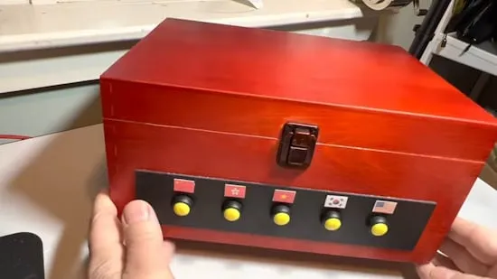

# 打造一个农历新年盒子

这个木盒正面有五颗纽扣，会用普通话、粤语、越南语、韩语或带有美式口音的英语表达农历新年问候。

使用了 Adafruit Feather RP2040 开发板，通过 circuitpython 编程。

## 相关链接

- [制作说明](https://www.instructables.com/Build-a-Lunar-New-Year-Box-Talking-Portable-and-Mu/)
- [github 仓库](https://github.com/gallaugher/lunar-new-year-box)
