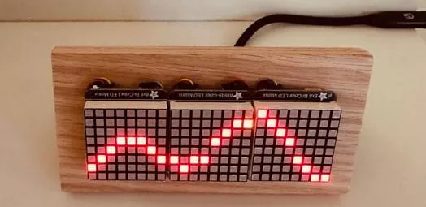

# 潮汐钟

使用3块8×8 LED双色点阵屏和运行CircuitPython的ESP32 FeatherWing制作的潮汐钟。一天中的每个小时都以水平方式显示，LED以黄色表示当前小时。每当刚过午夜，它就会从NOAA（美国国家海洋和大气管理局）更新当天的最新图表。

## 相关链接

- [Mastodon](https://mastodon.social/@MigsterTech@hachyderm.io/116030084924727327)
- [github 仓库](https://github.com/migster/TideClock)
