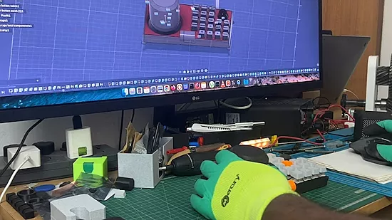

# 终极融合360度控制器

这是一个使用 Raspberry Pi Pico 和 CircuitPython 制作的 DIY 宏键盘和空间鼠标。它是Fusion 360、Blender和编程的高效工作站。它配备了一个定制的5×5机械按键矩阵、两个用于滚动和调节音量的旋转编码器，以及一个6自由度空间鼠标（基于磁力计），可让您在3D空间中实现环绕、平移和缩放操作。

[github 仓库](https://github.com/jeevan8232/macrokeyboard)
