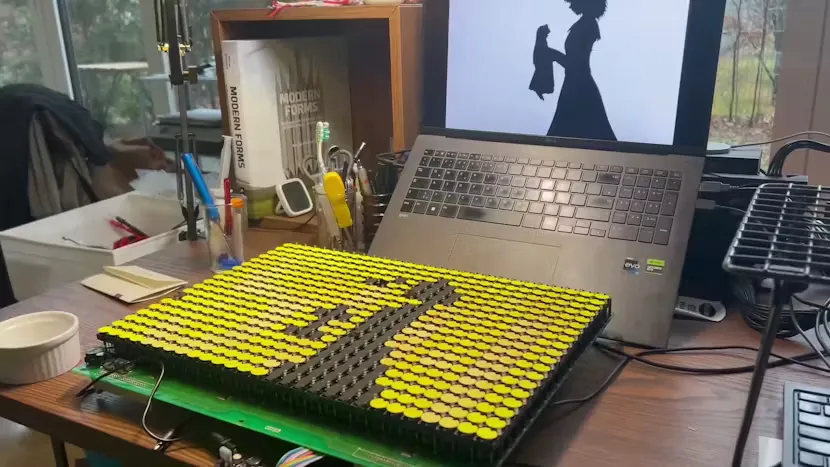

# 翻点显示屏

用现代硬件唤醒复古翻转点状显示屏的魔力，让复古机械像素焕发生机。

我们常常把像素看作 LED 矩阵或液晶显示屏上的可单独寻址单元。然而，虽然这些是像素的类型，但它们并不是唯一符合定义的例子。事实是，像素可以比这更奇特。它们甚至不需要被照亮就能产生动态图像。

以翻转点显示器为例。这些机械显示器物理上将有色面和黑面的点翻转，从而生成图像。通过这种显示方式，可以获得与任何现代数字显示截然不同的效果。

## 相关链接

- [Codeberg.org](https://codeberg.org/generallyokay/pages/src/branch/main/flipdot-bad-apple-2026.md)
- [hackster.io](https://www.hackster.io/news/bringing-flip-dot-displays-into-the-21st-century-4cbc186d6f35)
