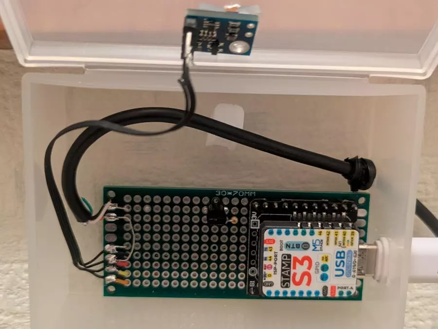
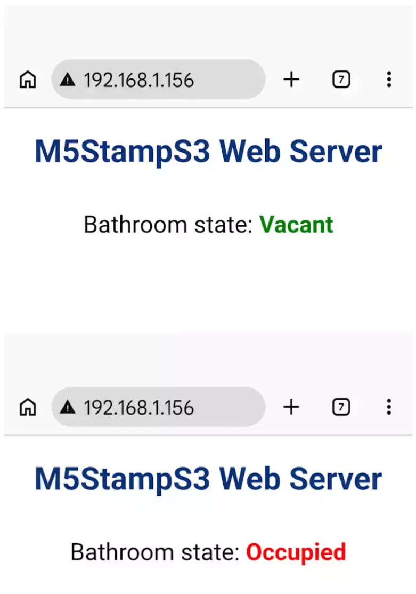

# 薛定谔的厕所: 你是否在那里

在我们四口之家,浴室的门有一扇小窗户,但我们常常忘记关灯,长时间保持开灯。我们经常发现自己不确定是否有人在屋内,直到我们敲门或开门。虽然敲门声能揭示真相,但这样做可能会让人感到尴尬——我可能好像在把人逼到里面。另一方面,打开门时不敲门——假设没有人在那里——反而会带来更加尴尬的局面。为防止这种情况,我使用M5Stamp-S3、ToF距离传感器和激光二极管构建了一个系统;只要有人在室内,它都会用明亮的红光照亮门窗。



使用 M5Stamp-S3 通过 MicroPython 编程的。它使用定时器中断，每秒用ToF传感器测量一次距离，如果测量距离低于设定阈值，则设备会确定一个人存在并发出激光束。

它还具有一个内置的网络服务器，允许用户通过连接到同一Wi-Fi网络的智能手机查看洗手间的占用状态。web服务器利用套接字模块来监视端口80，并提供指示占用状态的HTML页面。

**所用硬件列表**

- 微控制器: M5Stamp-S3
- 高转距离传感器: VL53L0X
- 半导体激光: 650纳米5米瓦激光模块
- 晶体管: 2SC2655L(用于激光模块驱动)

**项目创新特点**

虽然基本概念涉及使用ToF距离传感器检测占用情况，并使用M5Stamp点亮门外的LED，但弄清楚如何为门本身供电是一个令人惊讶的棘手挑战。

为了解决这个问题，我决定使用半导体激光器（激光二极管）。通过将激光二极管安装在容易获得电源的墙上，并将窄而直的光束对准门的视觉面板，我可以使面板发出明亮、清晰可见的红色。这使得占用状态立即清晰可见，无需敲门，防止意外进入。



**参考代码**

```python
from machine import Pin, I2C, Pin, reset, soft_reset, Timer
from time import sleep
import network
import boot

from VL53L0X import VL53L0X
try:
  import usocket as socket
except:
  import socket

import esp
esp.osdebug(None)

import gc
gc.collect()

# DEBUG mode
#DEBUG = True
DEBUG = False

# I2C configuration (GPIO13 = SDA, GPIO15 = SCL)
i2c = I2C(0, scl=Pin(15), sda=Pin(13), freq=400000)
laser = Pin(7, Pin.OUT)   # Configure GPIO7 as digital output

# Initialize VL53L0X distance sensor
tof = VL53L0X(i2c)

# Start continuous measurement mode
tof.start()

# Presence detection threshold (mm): values below this indicate occupancy
DIST = 1200

# Static IP configuration
FIXED_IP = '192.168.1.156'

# WiFi credentials
ssid = boot.ssid
password = boot.password

station = network.WLAN(network.STA_IF)
station.active(False)
sleep(5)
station.active(True)
station.connect(ssid, password)
while not station.isconnected():
    pass

station.config(pm=station.PM_NONE)  # Disable WiFi power saving for maximum performance
station.ifconfig((FIXED_IP, '255.255.255.0', '192.168.1.1', '192.168.1.1'))
print('Connection successful')
print(station.ifconfig())

def web_page():
    bathroom_state = "\"red\">Occupied" if laser.value() else "\"green\">Vacant"
    html = """
    <html>
        <head>
            <title>M5StampS3 Web Server</title>
            <meta name="viewport" content="width=device-width, initial-scale=1">
            <link rel="icon" href="data:,">
            <style>html{font-family: Helvetica; display:inline-block; margin: 0px auto; text-align: center;}
                h1{color: #0F3376; padding: 2vh;}
                p{font-size: 1.5rem;}
            </style>
        </head>
        <body>
            <h1>M5StampS3 Web Server</h1> 
            <p>Bathroom state: <strong><font color = """ + bathroom_state + """</font></strong></p>
        </body>
    </html>"""
    print(html)
    return html

# Timer interrupt callback
def timer_callback(timer):
    measure_distance()

# Use hardware timer 0
timer = Timer(0)

# Execute every 1000 ms (1 second)
timer.init(
    period=1000,
    mode=Timer.PERIODIC,
    callback=timer_callback
)

def measure_distance():
    distance = tof.read()   # Read distance in millimeters
    print("Distance:", distance, "mm")
    if distance < DIST:
        laser.on()
    else:
        laser.off()

s = socket.socket(socket.AF_INET, socket.SOCK_STREAM)
s.settimeout(None)
s.bind(('', 80))
s.listen(5)

if not DEBUG:
    try:
        while True:
            conn, addr = s.accept()
            print('Got a connection from %s' % str(addr))
            request = conn.recv(1024)
            request = str(request)
            print('Content = %s' % request)
            ret = request.find('/')
            response = web_page()
            conn.send('HTTP/1.1 200 OK\nContent-Type: text/html\nConnection: close\n\n')
            conn.write(response)
            conn.close()
    except KeyboardInterrupt:
        print('KeyboardInterrupt')
        timer.deinit()
        soft_reset()
    except Exception as e:
        print('catch Error:', e)
        timer.deinit()
        sleep(5)
        reset()
else:
    while True:
        conn, addr = s.accept()
        print('Got a connection from %s' % str(addr))
        request = conn.recv(1024)
        request = str(request)
        print('Content = %s' % request)
        ret = request.find('/')
        response = web_page()
        conn.send('HTTP/1.1 200 OK\nContent-Type: text/html\nConnection: close\n\n')
        conn.write(response)
        conn.close()
```

**🔗文章链接**

https://www.hackster.io/otojun8959/schrodinger-s-toilet-are-you-in-there-or-not-e5a667
