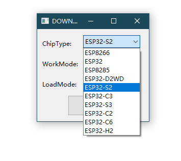
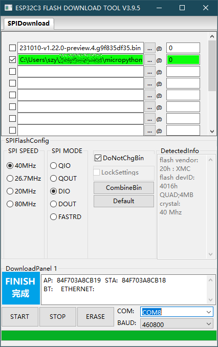
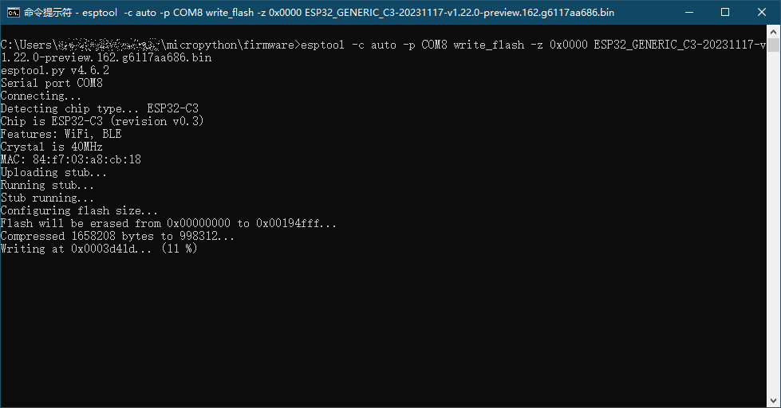
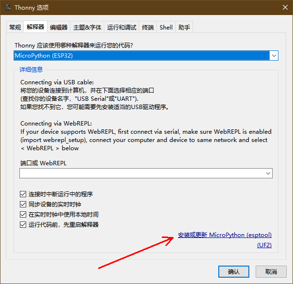
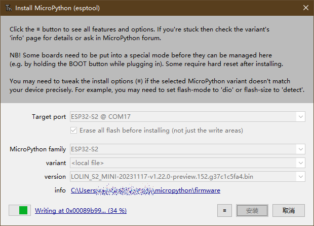

# esp32/esp8266

esp32 和 esp8266 芯片固件下载的方式是一样的，都是通过 usb 或者串口下载，只是参数上稍有区别。目前有多种软件支持下载固件，下面介绍最主要的几种。
   
## Flash 下载工具   

Flash 下载工具（Flash Download Tool）是乐鑫官方提供的下载软件，它是一个标准的 windows 软件，带有容易操作的图形界面，可以方便的选择参数并下载程序，是 esp 系列芯片最常用的下载软件之一。Flash 下载工具的链接在：

[https://www.espressif.com.cn/zh-hans/support/download/other-tools](https://www.espressif.com.cn/zh-hans/support/download/other-tools)

下载 Flash Download Tool 软件后，展开到任意目录，无需安装就可以使用。

Flash Download Tool 支持 esp 全系列的芯片，运行后需要先选择芯片的型号，然后才会进入程序下载界面。

在程序下载界面中，需要选择固件文件、设置固件文件起始地址、以及 SPI、串口等参数，波特率可以任意选择，它是自适应的，较高的波特率可以更快传输文件，但是速率太高时有些硬件可能会造成下载失败，通常设置为 460800 可以兼顾速度和稳定性。软件可以一次设置多个文件，但只有选中（打勾）的文件才会被下载到芯片。ERASE 按钮对应功能的是擦除 flash 内容，而 START 对应功能下载固件。通常情况下第一次下载固件时需要进行擦除，这样 micropython 运行后会自动创建用户文件系统，而以后升级就不需要擦除了（这样也不会清除以前保存的 micropython 用户程序）。
   
下载前开发板需要先进入升级模式，大部分开发板都有 RST（复位）和 BOOT（升级）按钮，按住 BOOT 键不放同时按一下复位键，就可以进入升级模式。有些开发板比较紧凑，没有按钮，就需要用镊子或其它方式短连 RST 和 BOOT 功能对应引脚（目前大部分ESP32 系 列 中 BOOT 都 是 对 应 GPIO0， 只 有 esp32-c3 使 用 了 GPIO9） 。 有些 esp32/esp8266 开发板支持一键下载，可以通过 usb 转串口芯片的 DTR 和 RTS 信号自动设置为升级模式。 
   

   
设置好参数就可以点击 ERASE 擦除芯片内容和 START 下载固件。注意目前不同型号的芯片固件对应的起始地址是不同的，对于 esp32、esp32-s2 是 0x1000，而 esp32-c3、esp32-s3 是 0。
   
## esptool

在 windows 和 Linux 下都可以用 esptool.py 下载程序，这是一个 python 的模块，使用命令行方式通过串口下载程序。使用 esptool.py 需要先安装 python（安装python 时选择将 python 目录添加到系统路径中，这样就可以在任意位置运行），然后通过 python 的包管理工具 pip 进行安装：

`pip install esptool`

因为默认的 PyPi 软件源在国外，直接通过 pip 安装时速度可能会比较慢，甚至会安装失败，这时可以指定使用国内的镜像加快下载速度。最简单方式就是在 pip 的命令行最后添加 -i 参数指定镜像网站，如使用清华的镜像网站：
   
`pip install esptool -i https://pypi.tuna.tsinghua.edu.cn/simple` 

安装了 esptool 后，在 windows 下先运行“命令提示符”或者 powershell，然后在命令行中输入相关命令就可以下载固件了。esptool 的基本运行形式是：
   
`esptool -p PORT -c CHIP CMD` 
   
- `-p` 或  `--port`，指定下载串口
- `-c` 或 `--chip`，指定芯片型号，也可以选择 `auto`，让软件自动识别
- CMD，操作命令，不同命令后面还有不同参数

   
如果不清楚 esptool 的用法，可以不带参数运行 esptool，它就会在屏幕上打印出各种参数的用法。esptool 的功能很多，但我们最常用的就是擦除和下载。如：

- **擦除**

  `esptool -p COM8 -c auto erase\_flash`

- **下载**
   
  `esptool -p COM8 -c esp32 -b 460800 write\_flash -z 0x1000 ESP32\_GENERIC-20231005-v1.21.0.bin` 

上面例子中使用的是 `COM8`，因为在 windows 中串口号会和用户环境有关，所以使用时请修改为实际的串口号（在 windows 下，可以在命令行下通过 `mode` 命令查看系统中可用的串口设备）。如果固件文件不在当前目录，还需要指定固件文件的路径或者先切换到固件文件目录，否则会提示找不到文件。   
   

   
如果是 Linux 操作系统，需要在终端的 shell 提示符中运行 esptool，使用方式和 windows 下是相同的，主要区别是串口的形式不同，如：
   
`esptool.py —chip esp32 —port /dev/ttyUSB0 erase\_flash` 
   
Linux 下串口通常表示为 `/dev/ttyUSB0`、`/dev/ttyS0` 等，有多个设备时序号会递增，可以用 `ls /dev/tty*` 查看。
   
### esptool 在线版 

esptool 使用虽然方便，但是需要先安装 python，然后在安装 esptool，对于初学者还是比较复杂。有的网站为了方便初学者，提供了在线式的 esptool，可以通过浏览器直接对 esp32 进行编程（只支持带原生 usb 功能的型号），无需安装任何软件，只需要一个支持 webusb 功能的浏览器（目前大部分 chrome 内核浏览器都可以，包括windows 中最新的 Edge 浏览器，但不支持 IE、Firefox、Safari 浏览器），打开网站（如 Adafruit ESPTool 网站，类似功能的网站还有多个）就能下载固件：

https://adafruit.github.io/Adafruit_WebSerial_ESPTool/

使用时，先连接开发板到计算机，并进入升级模式，再点击右上角的 "Connect"（连接）按钮，就会弹出一个提示框，里面显示已连接到计算机的设备列表，从中选择开发板对应的设备后，再选择固件文件和设置参数，然后进行擦除（Erase）或者下载（Program），用法和前面 esptool 是一样的，非常方便。下载时会自动识别芯片型号，但需要根据芯片类型注意设置合适偏移量（请参考上个小节说明）。

### 用 Thonny 下载固件   

一些软件中内置了 esptool 功能，如新版本的 thonny 就内置了 esptool，可以直接下载固件到芯片（甚至可以自动从网上下载合适的固件文件），并且还能自动识别芯片型号，不用手工输入参数。

运行 thonny 后，打开软件的选项设置，在解释器标签页中，选择 MicroPython(ESP32)，在选项框的右下角就会出现“安装或更新 MicroPython (esptool)”的提示。

   
点击 "安装或更新 MicroPython (esptool)"，就会显示一个 "Install MicroPython" 的对话框。在这里可以选择固件文件（可以是本地文件或者网上自动下载）、芯片型号等参数。如果芯片中以前安装过固件，可以不选择 "Erase all flash before installing"（安装前擦除 flash 所有内容），以避免丢失以前的用户程序。

有些开发板不支持自动复位功能（特别是带有 USB 功能的 esp32-s2/esp32-s3 等），下载完成后可能会出现一个错误提示，大致意思是系统不能自动复位，需要手动复位才能进入开发模式。这时固件实际已经写入芯片中了，只需要按下复位按钮或者重新上电，就会开始运行 micropython。

## UF2 下载   

UF2 下载是一种比较方便的更新固件方式，它被 circuitpython 广泛应用，而micropython 也开始支持这种方式，在最新的 micropython 固件中，部分芯片已经开始提供 UF2 固件（只有带有原生 usb 功能的芯片才支持 uf2 下载，如 esp32-s2、
esp32-s3，而最早的 esp32 是不支持 uf2 下载的；有的开发板带有两个 usb 口，如ESP32-S3-DevKitC-1，需要连接标有 usb 的那个接口）。
   
下面我们以 esp32-s2 mini 开发板（这个开发板比较容易购买）为例，介绍它的使用方法。
   
首先，到 circuitpython 的网站下载对应的 uf2 bootloader（在网站中 esp32-s2 mini 开发板对应的名称是 LOLIN S2 Mini，通常 uf2 bootloader 的下载链接在开发板页面的右下角）。下载网址是：
   
[https://circuitpython.org/downloads](https://circuitpython.org/downloads)
   
下载后会得到一个类似 tinyuf2-lolin\_s2\_mini-0.16.0.zip 的文件，将文件解压缩，找到其中的 combined.bin 文件，将它用前面介绍的方法下载到开发板中（偏移量设置为 0）。
   
下载后开发板重新上电，就会显示出一个名称是 S2MINIBOOT 的磁盘，将 uf2 格式的固件文件复制到这个磁盘，就可以升级固件。升级后开发板会自动复位，运行micropython，这时将不会显示出 USB 磁盘了。注意虽然 UF2 磁盘中显示的容量是 32M，但这并不是真实容量。

使用 uf2 模式，如果要再次升级固件，就需要重新进入 uf2 bootloader。进入uf2 bootloader 的方法和进入 DFU 升级模式不同，在 esp32-s2 和 esp32-s3 中，是先按一下复位键，然后再快速按一下 BOOT 键，就可以进入 uf2 bootloader 模式（在
circuitpython 其它 mcu 的开发板中，是快速按两次复位键进入 uf2 bootloader）。 

如果你使用的开发板不在网站开发板列表中也没关系，只要芯片型号相同，uf2 bootloader 基本是通用的，但是引脚的定义可能会不同。
