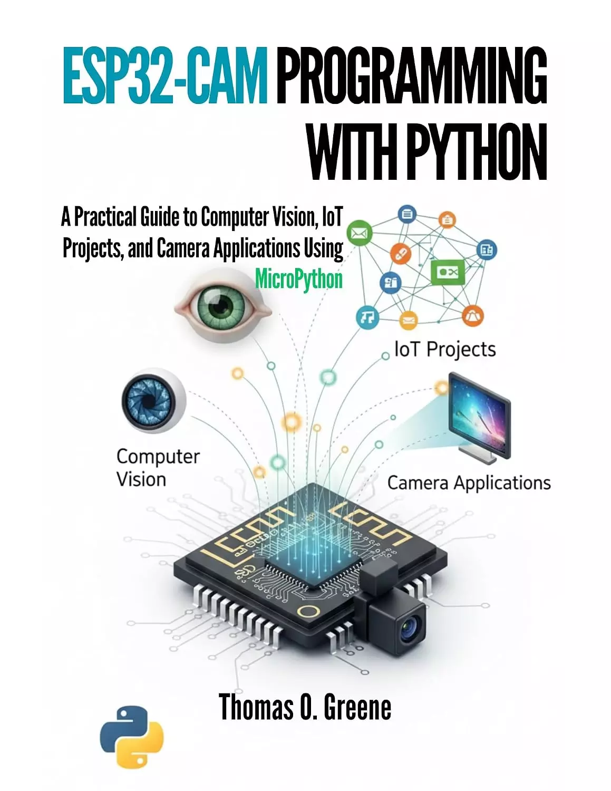

# ESP32-CAM Python编程：使用MicroPython的计算机视觉、物联网项目和相机应用程序实用指南 (ESP32-CAM Programming With Python: A Practical Guide to Computer Vision, IoT Projects, and Camera Applications Using MicroPython)

**小型硬件，真实视觉系统，建造了正确的道路。**

ESP32-CAM价格实惠、结构紧凑、功能强大。基于它构建的可靠相机系统并非如此，大多数项目之所以失败，是因为硬件的约束被忽视、误解或超出了其实际支持的范围。

在ESP32-CAM Python编程中，您将学习如何使用MicroPython设计、构建和部署实用的基于相机的系统——这些系统可以在单个演示或测试运行之外可靠地工作。在许多指南依赖于试错草图、不切实际的人工智能承诺和不稳定代码的环境中，本书重点关注真正重要的事情：将ESP32-CAM理解为一个嵌入式系统，并在更大的架构中正确使用它。

本书借鉴了嵌入式系统原理、物联网设计模式和现实世界的部署经验，在不将您锁定在特定供应商或云平台的情况下，为在面向生产的项目中使用ESP32-CAM提供了一个清晰的系统级框架。

**在本书中，您将学习如何：**

- 了解ESP32-CAM的设计目的是什么，以及它不是什么
- 在内存、电源和处理限制范围内工作，不会崩溃或不稳定
- 建立可靠的MicroPython开发环境
- 安全初始化和控制摄像头模块
- 无内存泄漏地捕获、存储和流式传输图像
- 通过web界面和REST API公开相机数据
- 使用MQTT和事件驱动设计将ESP32-CAM集成到物联网系统中
- 将摄像头系统连接到云平台，用于记录、监控和远程访问
- 使用Python和OpenCV将视觉处理卸载到PC或服务器
- 现实地实现运动检测、对象跟踪和分析管道
- 了解边缘人工智能、云人工智能和TinyML，而不过分承诺设备性能
- 构建监控摄像头、智能门铃和监控系统等实用项目
- 优化性能、功耗和网络吞吐量
- 安全的摄像头馈送、API和长时间运行的部署
- 从单一设备扩展到边缘云架构
- 识别何时需要超越ESP32-CAM，转向功能更强大的硬件

本书通过清晰的解释、架构图、项目演练、清单和故障排除指南，将硬件、固件、网络和软件连接成一条连贯的学习路径。它不是专注于孤立的代码片段或新颖的构建，而是强调设计决策、权衡和模式，这些决策、权衡以及模式在项目和平台之间仍然有用。

**ESP32-CAM Python编程**将可靠性、系统设计和长期可用性置于每一章的中心。您不仅将学习如何使相机工作，还将学习如何构建在真实环境中继续工作的系统。

**这本书是写给谁的：**

- 嵌入式系统开发人员和工程师
- 物联网开发人员和系统设计师
- Python程序员探索硬件和视觉系统
- 认真的业余爱好者转向生产质量项目
- 学生和专业人士构建基于摄像头的解决方案

ESP32-CAM不会因为性能不佳而出现故障。它之所以失败，是因为它被误解了。

这本书向你展示了如何从脆弱的实验转向可靠的相机系统，从孤立的草图到完整的架构，从不切实际的期望到工程清晰度。

如果你想构建实用、可扩展且诚实的ESP32-CAM项目，使用Python进行ESP32-CAM编程可以提供正确的指导——从首次启动到长期部署。

## 购买链接

- [亚马逊](https://www.amazon.com/-/zh/dp/B0GDV29P5C)
