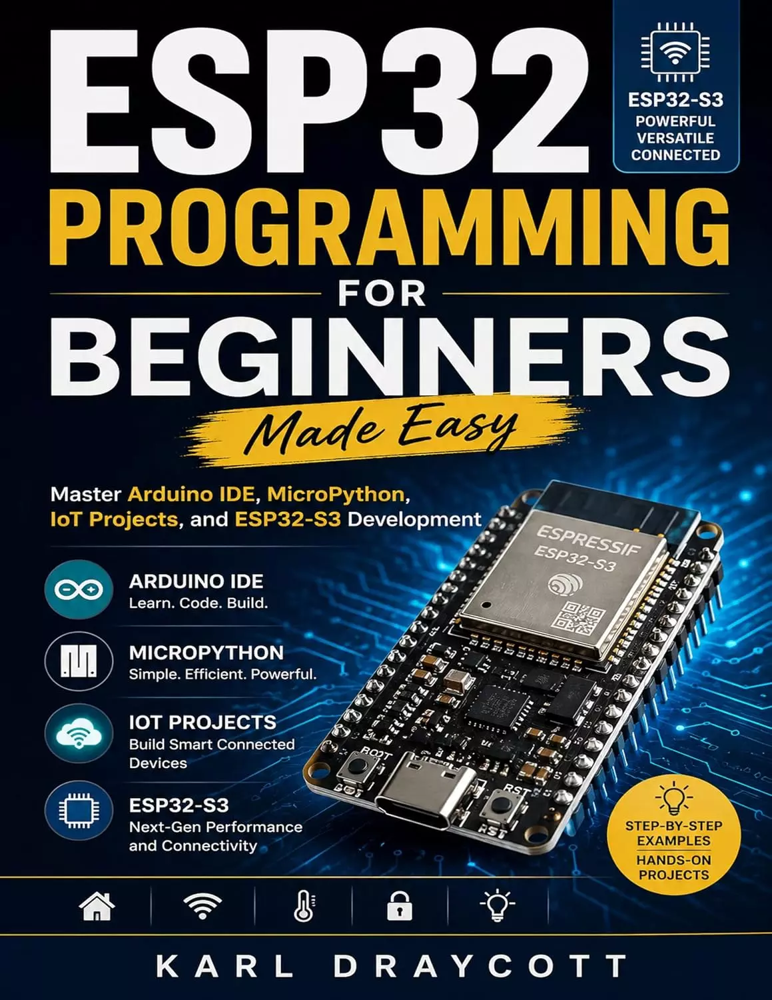

# ESP32编程入门变得简单：掌握Arduino IDE、MicroPython、物联网项目和ESP32-S3开发（智能系统和电子系列书2） ESP32 Programming for Beginners Made Easy: Master Arduino IDE, MicroPython, IoT Projects, and ESP32-S3 Development (Smart System & Electronic Series Book 2) 

你有没有看过智能设备、自动化系统或连接的小工具，并想知道“人们实际上是如何构建这些东西的？”

你是否想学习ESP32编程，但被复杂的教程、令人困惑的技术术语或认为你已经无所不知的书籍所淹没？

如果学习嵌入式系统、物联网开发、Arduino IDE和MicroPython真的能感觉简单、实用和令人兴奋呢？

**ESP32编程入门变得简单**是为像你一样的人写的。

无论你是初学者、业余爱好者、学生、创客，还是渴望进入快速增长的物联网和智能技术世界的人，这本书都会牵着你的手，以一种清晰、对话和易于理解的方式引导你完成整个过程。

你是否一直在寻找一个不只是向你扔随机代码的指南？
你想真正了解ESP32板是如何工作的，以及真正的物联网项目是如何从头开始构建的吗？
您是否对功能强大的ESP32-S3感到好奇，并想知道如何解锁其全部功能？

那么这本书就是你的起点。

在里面，您将了解如何使用Arduino IDE和MicroPython自信地使用ESP32，同时构建实用的、真实的项目，逐步增强您的技能。

您将学习如何：
- 自信地设置和编程ESP32板
- 了解物联网发展的基本原理
- 使用传感器、Wi-Fi、蓝牙和智能设备通信
- 构建实践项目，自然地加强学习
- 探索ESP32-S3功能和高级功能
- 编写更干净、更高效的代码，而不会感到迷失
- 将创意转化为功能性的互联系统

**没有不必要的复杂性。没有令人生畏的解释。只有真正有意义的实践学习。**

想象一下，即使你今天从零开始，也能创建自己的智能家居系统、无线监控设备、自动化项目和互联应用程序。

在一个日益由自动化、人工智能和互联技术驱动的世界里，这种技能能值多少钱？

本书旨在通过易于理解、引人入胜且适合初学者的课程，帮助您从困惑走向自信，同时为您成长为更高级的ESP32开发奠定基础。

**当你可以开始构建自己的项目时，为什么还要继续看着别人构建令人惊叹的项目呢？**

未来属于创造者、创新者和问题解决者。
最好的部分呢？你不需要工程学学位就可以开始。

你所需要的只是好奇心、学习意愿和正确的指导。

您进入ESP32编程、物联网创新和智能设备开发的旅程从这里开始。

## 购买链接

- [亚马逊](https://www.amazon.com/-/zh/dp/B0H395JFHV)
