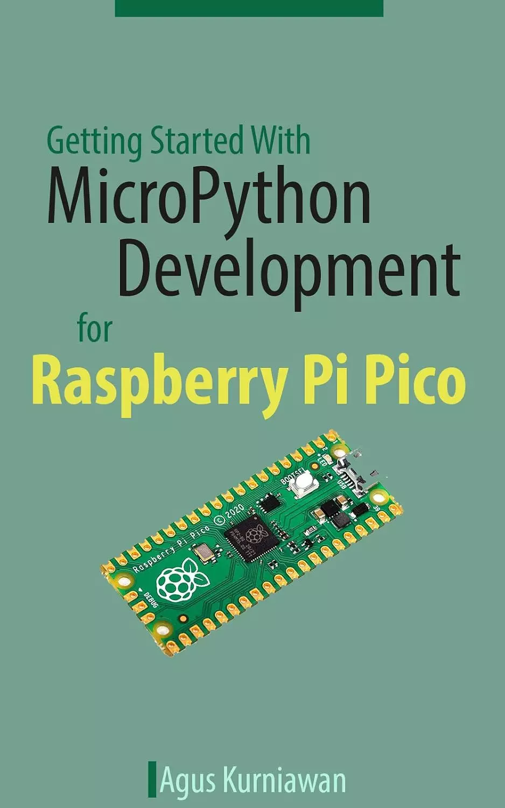

# Raspberry Pi Pico MicroPython开发入门 (Getting Started With MicroPython Development for Raspberry Pi Pico)

本书专为学习如何开始使用Raspberry Pi Pico的MicroPython开发的人而设计。这本书介绍了Raspberry Pi Pico和Python。以下是重点主题列表：
- 准备开发环境
- 设置MicroPython
- GPIO编程
- PWM和模拟输入
- 使用I2C
- 使用UART
- 使用SPI
- 温度和湿度工作（DHT模块）
- 通过WiFi构建物联网应用
- 通过蓝牙从Android读取Raspberry Pi Pico上的传感器
- 使用OLED I2C显示器
- 使用文件系统
- 使用GPS U-blox模块

## 购买链接

- [亚马逊](https://www.amazon.com/-/zh/dp/B08Y7QVYGD)
