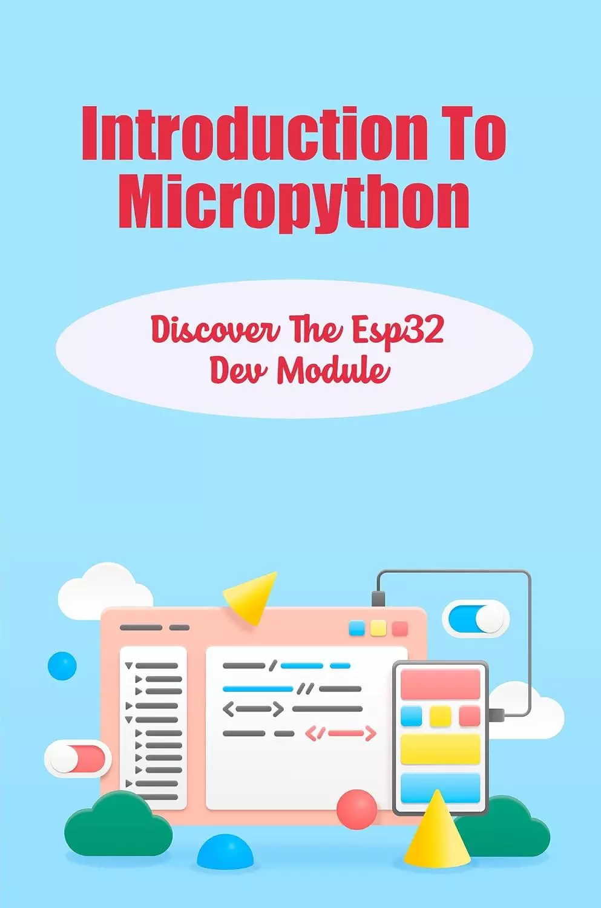

# Micropython简介：探索Esp32开发模块 (Introduction To Micropython: Discover The Esp32 Dev Module)

MicroPython是Python 3的重新执行，专注于微控制器和植入框架。MicroPython与常规Python相同。按照这些思路，假设你知道如何用Python编程，你也知道如何用MicroPython编程。这本接收器书希望阐明有关微型 python 在 esp32和esp8266的见解，包括放大器的使用。本书分为6个模块：

- 课程序言
- 为课程设置产品
- 在 ESP32 上 升级MicroPython固件
- Python 3 结构，使用Micropython回顾
- 控制GPIO引脚
- 通过WiFi与网络连接

## 购买链接

- [亚马逊](https://www.amazon.com/-/zh/dp/B0B6RNG64X)
