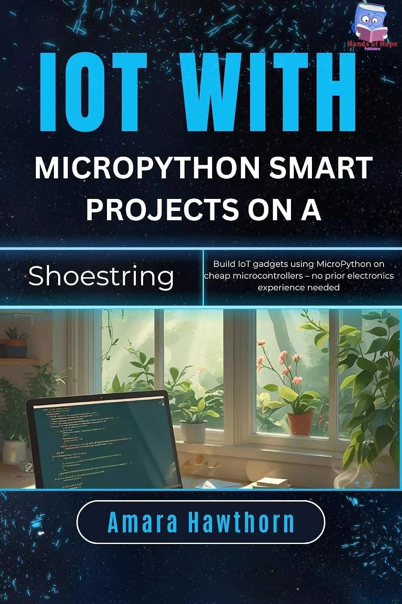

# 物联网与MicroPython智能项目:在廉价微控制器上使用MicroPython构建物联网设备—无需电子技术经验 (IoT with MicroPython Smart Projects on a Shoestring: Build IoT gadgets using Micro Python on cheap microcontrollers – no prior electronics experience needed)

使用MicroPython的物联网：Shoestring上的智能项目是您进入令人兴奋的物联网世界的入门级门户，无需陡峭的学习曲线或昂贵的硬件。无论你以前从未接触过电路板，还是对编写微型设备感到好奇，这本实践指南都让构建智能设备变得触手可及、经济实惠且有趣。

通过清晰的解释和循序渐进的项目，您将了解如何使用MicroPython（Python的轻量级版本）将廉价的微控制器（如ESP8266或ESP32）变为现实。您将学习如何连接传感器、控制设备，并在预算范围内构建现实世界的物联网应用程序。无需电子学位或以往经验。

在这里，您将探索如何：
- 在低成本微控制器上设置MicroPython
- 从传感器读取数据并以创造性的方式显示
- 将设备连接到Wi-Fi和云端进行远程控制
- 构建气象站、智能灯等实用项目
- 自信地解决初学者常见的错误

这本书非常适合业余爱好者、学生、维修人员和有好奇心的人，它将经济实惠的组件转化为强大的互联项目。到最后，你不仅会了解物联网是如何工作的，还会拥有自己的DIY智能设备。

## 购买链接

- [亚马逊](https://www.amazon.com/-/zh/dp/B0FPSDBGHG)

