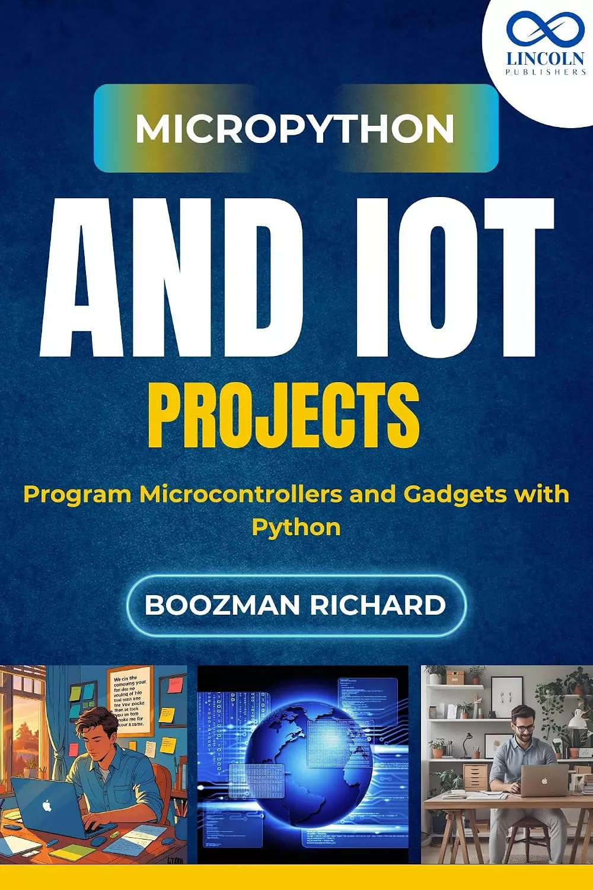

# MicroPython和物联网项目：用Python编程微控制器和小工具 (MicroPython and IoT Projects: Program Microcontrollers and Gadgets with Python)

构建智能设备。学习MicroPython。把你的想法变为现实。

MicroPython和IoT项目是您在ESP32和Raspberry Pi Pico等微控制器上使用Python的初学者友好指南。如果你曾经想用Python而不是C或Arduino来控制灯、传感器或其他硬件，这本书就是为你准备的。

本书在设计时考虑到了实际的学习者，引导您逐步完成将编码与现实世界硬件相结合的项目。你将连接传感器，将数据推送到云端，甚至从手机控制设备——同时编写干净的Python代码，在小巧高效的板上运行。

在这里，您将构建以下项目：
- **Wi-Fi温度记录仪**: 监控室温并将数据推送到谷歌表格或网络仪表板
- **运动激活LED报警**: 检测运动并触发灯或蜂鸣器
- **蓝牙设备控制器**: 使用手机无线控制小工具
- **智能植物监测仪**: 测量土壤湿度，并在浇水时发出警报
- **IoT按钮**: 向web应用程序或智能家居平台发送自定义命令
- **OLED屏幕数据显示**: 在小屏幕上显示传感器值或消息

您将学习如何：
- 将MicroPython固件下载到ESP32和Raspberry Pi Pico上
- 使用GPIO连接传感器和执行器
- 使用Wi-Fi和蓝牙
- 通过MQTT、HTTP和API发送和接收数据
- 使用umqtt、urequests和machine等库
- 排除故障、优化和扩展您的项目

无论你是电子爱好者、Python程序员还是技术教育者，这本实践性的书都能为你提供开始用Python构建真正的物联网项目所需的一切，而不是理论。

## 购买链接

- [亚马逊](https://www.amazon.com/-/zh/dp/B0FH5YFD3W)
