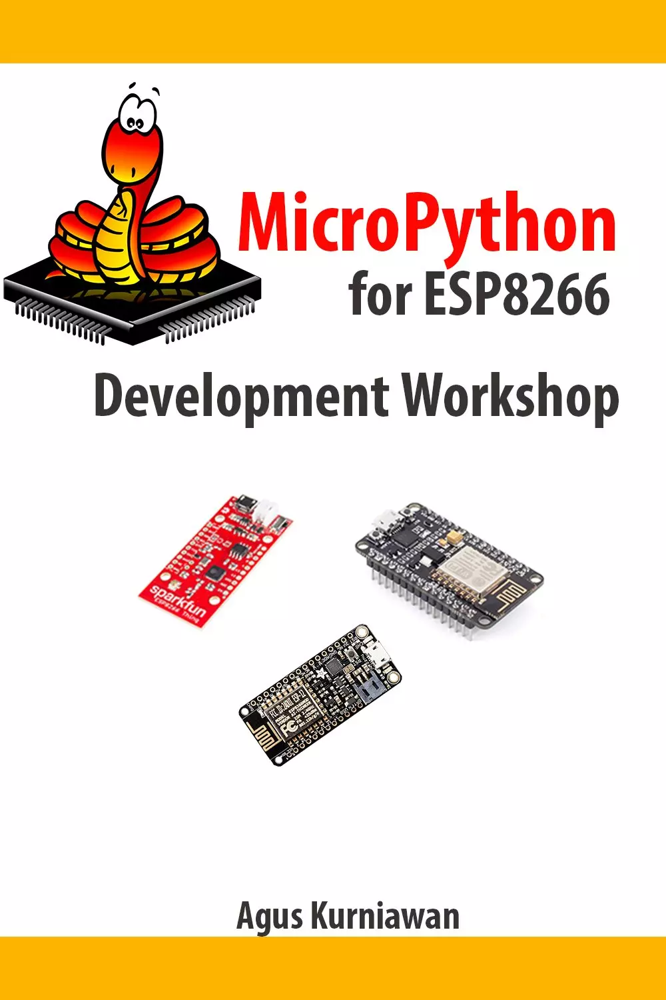

# MicroPython for ESP8266开发研讨会 (MicroPython for ESP8266 Development Workshop)

本书探讨了如何使用MicroPython开发ESP8266模块和板，如NodeMCU、SparkFun ESP8266 Thing和带ESP8266 WiFi的Adafruit Feather HUZZAH。以下是本书的重点主题

- 准备开发环境
- 设置MicroPython
- GPIO编程
- PWM和模拟输入
- 使用I2C
- 使用UART
- 使用SPI
- 使用DHT模块

## 购买链接
- [亚马逊](https://www.amazon.com/-/zh/dp/B01N8V3UEZ)
