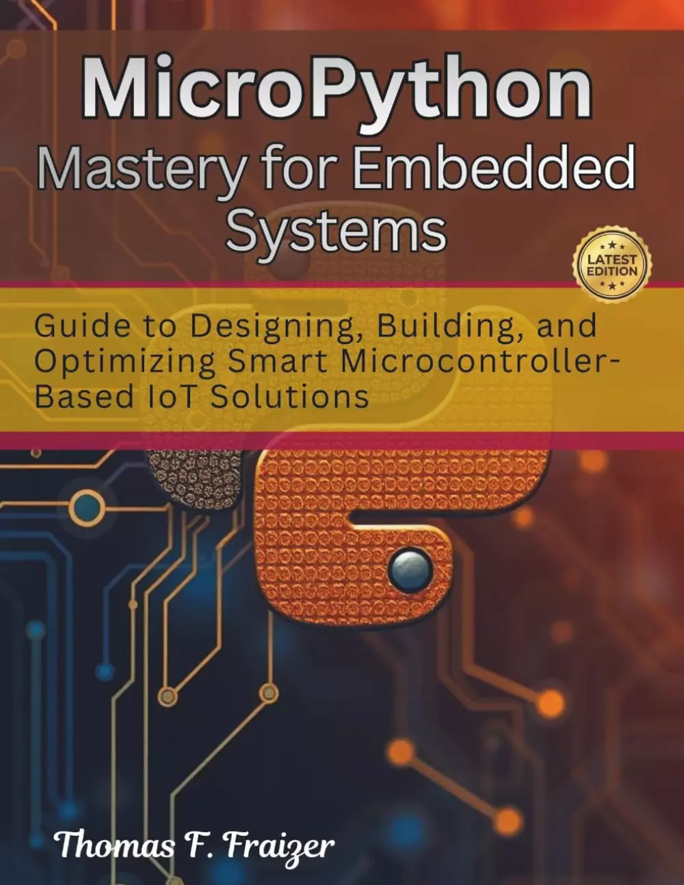

# MicroPython掌握嵌入式系统：基于智能微控制器的物联网解决方案的设计、构建和优化指南（电气工程和编程书籍）(MicroPython Mastery for Embedded Systems: Guide to Designing, Building, and Optimizing Smart Microcontroller-Based IoT Solutions (electrical engineering and programming books) )

你准备好超越基本的编码，开始构建真正解决问题的智能现实设备了吗？

MicroPython掌握嵌入式系统：设计、构建和优化基于智能微控制器的物联网解决方案指南是为那些想要超越理论的好奇者编写的——你想要可以立即应用的实用技能。无论你是学生、业余爱好者还是专业人士，本书都会引导你完成将简单想法转化为功能齐全、高效的嵌入式解决方案的过程。

你有没有想过小型设备是如何收集数据、做出决策和无缝通信的？本指南以清晰、易懂的方式将其全部分解。您将探索如何设计可靠的系统，编写干净高效的代码，并优化性能，以便您的项目即使在资源有限的情况下也能顺利运行。

这本书没有用行话淹没你，而是专注于动手理解。您将学习如何连接传感器、管理输入和输出，以及构建与现实世界交互的响应系统。在此过程中，您还将发现提高速度、降低功耗和解决常见问题的技术。

您是否正在考虑创建更智能、更互联的解决方案？这本书可以帮助你建立信心，进行实验、创新，并将你的想法提炼成有意义的东西。

如果你正在寻找一条实用、引人入胜的嵌入式开发之路，采用现代、灵活的方法，那么这就是你的起点。

## 购买链接

- [亚马逊](https://www.amazon.com/-/zh/dp/B0GV7QXP9W)

