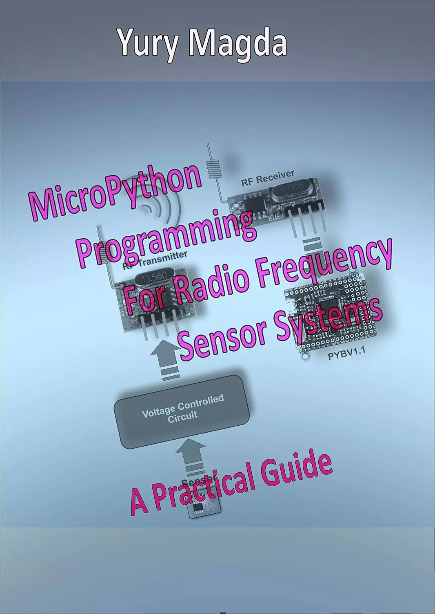

# 射频传感器系统的 MicroPython 编程：实用指南 (MicroPython Programming For Radio Frequency Sensor Systems: A Practical Guide)

这本书被认为是一本非常实用的指南，描述了设计和编程简单的射频（RF）传感器系统。假设读者具有组装简单电子电路和MicroPython编程的经验。本指南中描述的示例的MicroPython源代码简单明了，易于重复和修改。

所有示例都在PYBV1.1板上进行了测试，尽管它们可以在任何配备STM32F4xx微控制器的MicroPython板上工作。

## 购买链接

- [亚马逊](https://www.amazon.com/-/zh/dp/B089WC8XBK)

