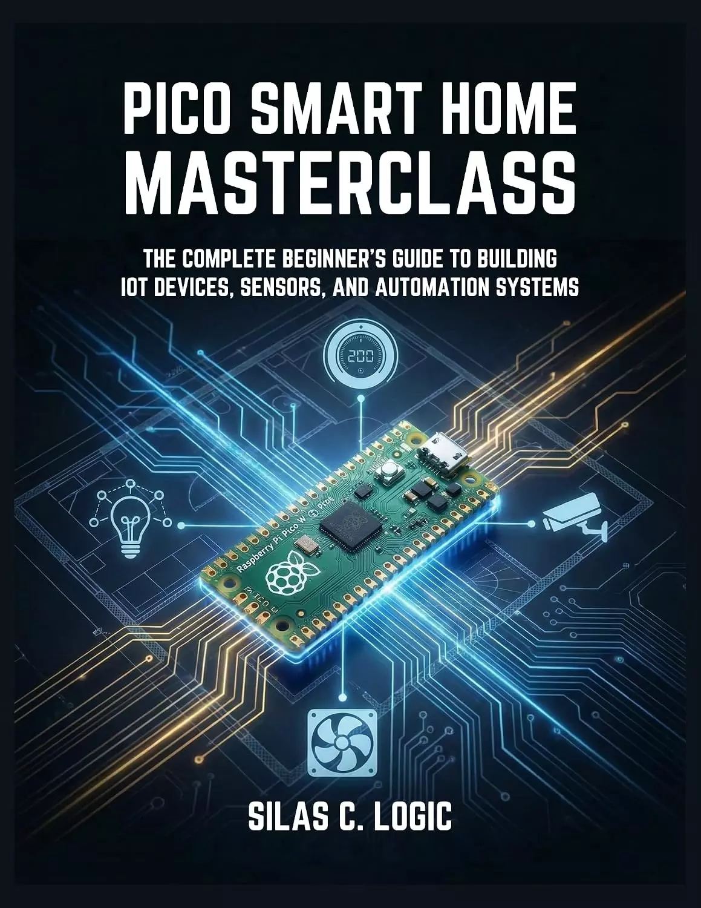

# PICO智能家居大师：使用Raspberry Pi PICO W和MicroPython构建物联网设备、传感器和自动化系统的完整初学者指南 (PICO SMART HOME MASTERCLASS: The Complete Beginner’s Guide to Building IoT Devices, Sensors, and Automation Systems with Raspberry Pi Pico W and MicroPython)

**你想建造一个真正属于你的智能家居吗？没有月费、隐私风险，也不依赖昂贵的专有中心？**

想象一下，走进客厅，灯光会自动调节。想象一下，手机在地下室管道漏水的那一刻嗡嗡作响，或者风扇在房间太热的那一瞬间打开。

不需要工程学学位来建造这个，只需要一个6美元的Raspberry Pi Pico W和这本书。

**Pico智能家居大师**不仅仅是一本编程教科书。这是一个实践工作坊，将你从“拆箱”带到“从世界的另一端控制你的房子”。本指南由物联网专家Silas C.Logic撰写，去掉了行话，专注于结果。

**您将构建什么：**

- **智能气候控制器**：一个自动恒温器，监测温度/湿度，并使用专业的滞后逻辑控制冷却风扇。
- **Wi-Fi安全哨兵**：一个带有运动探测器、门传感器和即时电报推送通知到手机的防护报警系统。
- **家庭助理桥接**：使用ESPHome将您的DIY传感器集成到Apple HomeKit、Alexa和Google Home中。

**在里面，你会发现：**

- **MicroPython变得简单**：掌握物联网语言，而不会陷入复杂的语法。
- **“W”因素**：如何像专业人士一样管理Wi-Fi连接、处理网络掉线和自动重新连接。
- **安全第一**：如何使用继电器和光耦合器安全地切换110V/220V市电。
- **数据可视化**：将您家的数据记录到云端，并在手机上构建漂亮的仪表板。
- **MQTT协议**：学习工业互联网的秘密语言，实现即时、无延迟的控制。

**专属奖励：**

停止手动输入代码！这本书包括一个免费下载的GitHub存储库，其中包含项目中使用的每个脚本、库和配置文件。您可以复制、粘贴并立即开始构建。

你家的未来不在你买的盒子里，而在你写的代码里。

## 购买链接

- [亚马逊](https://www.amazon.com/-/zh/dp/B0GGDL9F5J)
