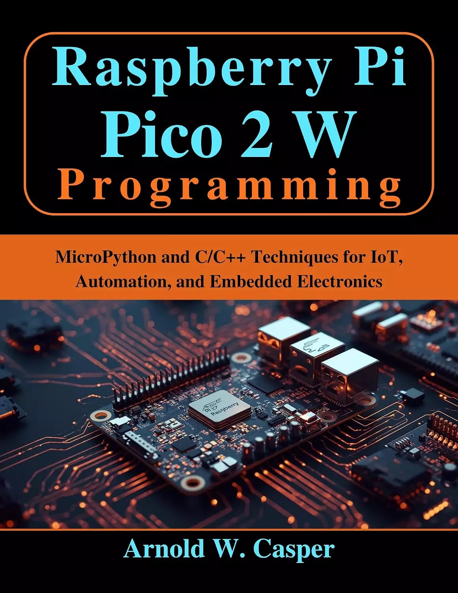

# Raspberry Pi Pico 2 W编程：用于物联网、自动化和嵌入式电子的MicroPython和C/C++技术（今天是初学者，明天是技术专业人士） Raspberry Pi Pico 2 W Programming: MicroPython and C/C++ Techniques for IoT, Automation, and Embedded Electronics (Beginner Today, Professional Tomorrow in Tech) 

你有没有想过，是什么让微控制器在性能和多功能性方面真正强大？您是否好奇如何在您的项目中利用双核架构、可编程I/O和高级无线连接？想象一下，能够控制电机、读取多个传感器、管理实时任务并安全地将数据传输到云端——所有这些都可以通过一个紧凑、低功耗的设备实现。

你知道如何优化功耗、实现DMA驱动的高速数据采集或利用PIO进行时序关键应用吗？或者如何安全地处理固件更新、证书和加密通信，同时保持稳健的网络性能？即使是经验丰富的开发人员在设计专业级物联网系统、机器人应用程序和分布式传感器网络时也会问这些问题。

你能从MicroPython和C/C++开发的分步指导、实用的部署策略和现实世界项目的实践示例中受益吗？这不仅仅是理论，而是关于构建高效、可靠和可扩展的嵌入式解决方案的对话。

无论你是一个寻求明确起点的初学者，一个致力于复杂物联网部署的制造商，还是一个设计低功耗、安全系统的专业工程师，这本书都涵盖了各个层面。它回答您的问题，解释“为什么”和“如何”，并为您提供掌握微控制器开发的策略和专家见解。

控制你的项目，将想法转化为功能齐全的系统，并释放先进微控制器技术的潜力——你在嵌入式开发方面的下一个突破就从这里开始。

## 购买链接

- [亚马逊](https://www.amazon.com/-/zh/dp/B0G6S16BR9)
