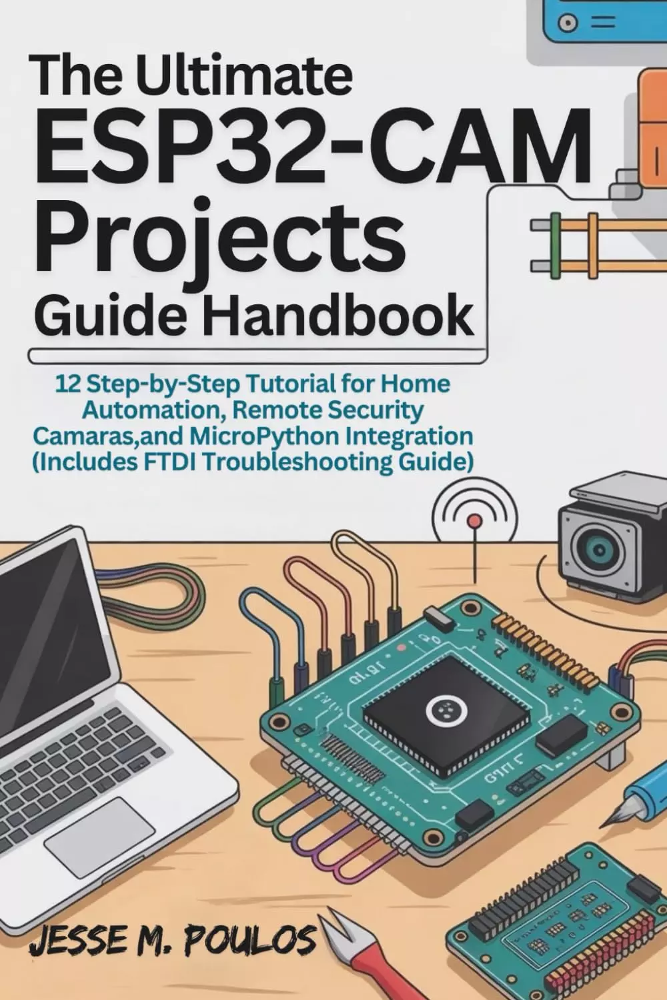

# 终极ESP32-CAM项目指南手册：12个家庭自动化、远程安全摄像头和MicroPython集成的分步教程（包括FTDI故障排除指南） THE ULTIMATE ESP32-CAM PROJECTS GUIDE HANDBOOK: 12 Step-by-Step Tutorials for Home Automation, Remote Security Cameras, and MicroPython Integration (Includes FTDI Troubleshooting Guide) 

准备好用ESP32-CAM将您的技术想法变为现实了吗？无论您是希望开始第一个项目的初学者，还是希望提高技能的经验丰富的开发人员，本书都将指导您使用强大的ESP32-CAM模块创建真实、功能强大的项目的每一步。

在这本全面的指南中，您将找到15个动手教程，涵盖从构建简单的安全摄像头到创建复杂的家庭自动化系统、人脸识别软件和人工智能物体检测的所有内容。每个项目都旨在帮助您从头开始了解ESP32-CAM，让您成为一个自信的制造者和问题解决者。

**里面有什么：**

- 逐步构建实用项目的教程，如远程安全摄像头系统、智能家居自动化和实时视频流。
- 即使您是编码新手，设置和编程ESP32-CAM的说明也易于遵循。
- 详细的故障排除提示，帮助您克服常见的连接和FTDI问题，确保您永远不会陷入困境。
- 帮助你立即应用新技能的实例，这样你不仅可以阅读，还可以创造。
- 关于改进项目、优化性能以及扩展到边缘AI和TinyML等更高级应用程序的提示。

这本书不仅仅是关于学习如何使用ESP32-CAM，而是关于构建一些可以在日常生活中使用的真实东西。无论您是想实现家居自动化、远程监控房产，还是探索物联网和人工智能的世界，本指南都将向您展示如何实现这一目标。

**您将学习如何：**

- 设置ESP32-CAM并使用MicroPython使其运行。
- 构建智能设备，创建安全的监控系统，并实现家庭自动化。
- 集成AI和TinyML，添加人脸和物体识别等智能功能。
- 解决FTDI适配器的连接和上传问题。
- 使用额外的技巧、工具和资源，将您的项目扩展到基础之外。

本书专为初学者和中级开发人员设计，将帮助您将您的想法转化为工作项目，这些项目既有趣又实用。

到本书结束时，您将不仅知道如何使用ESP32-CAM，还将拥有创建自己的创新项目、解决问题以及将知识扩展到物联网、人工智能和嵌入式系统等更先进领域的技能和信心。

立即使用ESP32-CAM进行构建、学习和创新。你的下一个技术项目将从这里开始。

## 购买链接

- [亚马逊](https://www.amazon.com/-/zh/dp/B0FWXFP77K)
