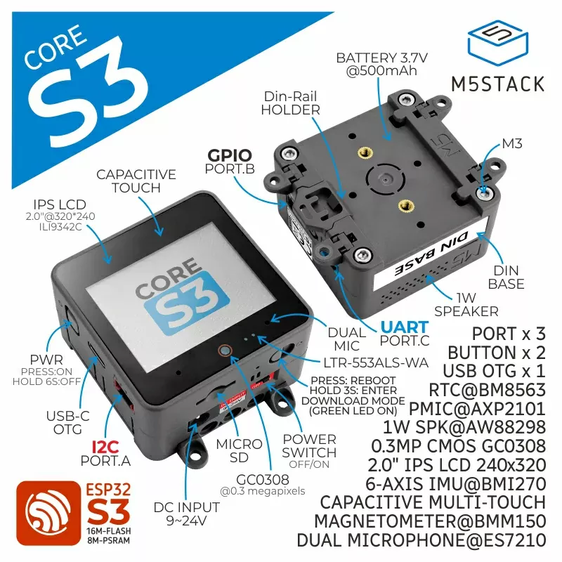

# M5Stack CoreS3

CoreS3 是 M5Stack 开发套件系列的第三代主机，核心主控采用 ESP32-S3，板载 16MB Flash 和 8MB PSRAM，可通过 USB Type-C 接口下载程序，支持 OTG 和 CDC 功能，方便外接 USB 设备和烧录固件，正面搭载一块 2.0 寸电容触摸 IPS 屏。

## 产品特性

* 基于 ESP32 开发，支持 Wi-Fi @16MB Flash，8MB PSRAM
* 内置摄像头、接近传感器、扬声器，电源指示灯，RTC，I2S 功放，双麦克风，电容式触摸屏幕，电源键，复位按键，陀螺仪
* microSD 插槽
* 高强度玻璃材质
* 支持 OTG 和 CDC 功能
* 采用 AXP2101 电源管理，低功耗设计
* 开发平台
	* UiFlow2
	* Arduino IDE
	* ESP-IDF
	* PlatformIO
	* micropython/circuitpython

## 原理图

* [CoreS3 原理图 PDF](https://m5stack-doc.oss-cn-shenzhen.aliyuncs.com/490/Sch_M5_CoreS3_v1.0.pdf)
* [Base DIN 原理图 PDF](https://m5stack-doc.oss-cn-shenzhen.aliyuncs.com/559/SCH_DinBase_V1.1.pdf)
* [Cores3 PcbDoc](https://github.com/m5stack/M5_Hardware/blob/master/Common/Module_Type_A/PCB/Module_Type_A_CoreS3_M5_Bus.PcbDoc)

## 相关链接

* [CoreS3 网站](https://docs.m5stack.com/zh_CN/core/CoreS3)
* [circuitpython 固件下载](https://circuitpython.org/board/m5stack_cores3_se/)

