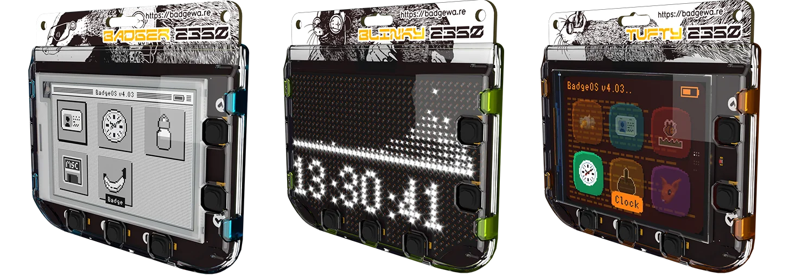

# Badgeware 智能徽章

Badgeware 系列智能徽章是上一代 [Pimoroni Badger](../badger-2040/readme.md) 的巨大升级，更坚固,采用时尚外壳,并内置电池供电。Badgeware 系列智能徽章内置WiFi和蓝牙功能，开箱即用，实现全面连接。您的应用程序可以从互联网获取实时数据，控制远程系统，甚至与其他徽章进行聊天——非常适合创造超越单一设备的有趣互动体验。

Badgeware 系列智能徽章目前有三个型号，分别是：Badger、Tufty、Blinky。它们使用了相同的控制器和接口，主要区别在于显示部分：Badger 使用了2.7英寸264×176灰度电子纸显示屏，Tufty 使用了 2.8英寸320×240全彩色IPS显示屏，Blinky 使用了 3.6英寸 872颗高亮白色LED阵列。

Badgeware 预装了很多有趣的应用，可以通过 micropython 编程，提供了内部 API 接口。

## 主要特点

* RP2350 双核 ARM Cortex-M33 @ 200MHz 控制器
* 512kB SRAM
* 16MB QSPI XIP flash
* 多种显示屏
* 2.4GHz WiFi 和蓝牙 5
* 1000mAh 可充电电池(运行时间8小时)
* 用于附件和调试的 Qw/ST 和 SDW 端口
* 五个正面按钮
* 电池电压监控和充电状态指示
* 用于充电和编程的USB-C接口
* 带有复位键
* LED背光
* 耐用的聚碳酸酯外壳

## 相关链接

- [网站](https://badgewa.re/)
- [文档](https://badgewa.re/docs)
- 固件和例程
	- [Tufty 2350](https://github.com/pimoroni/tufty2350)
	- [Blinky 2350](https://github.com/pimoroni/blinky2350)
	- [Badger 2350](https://github.com/pimoroni/badger2350)
