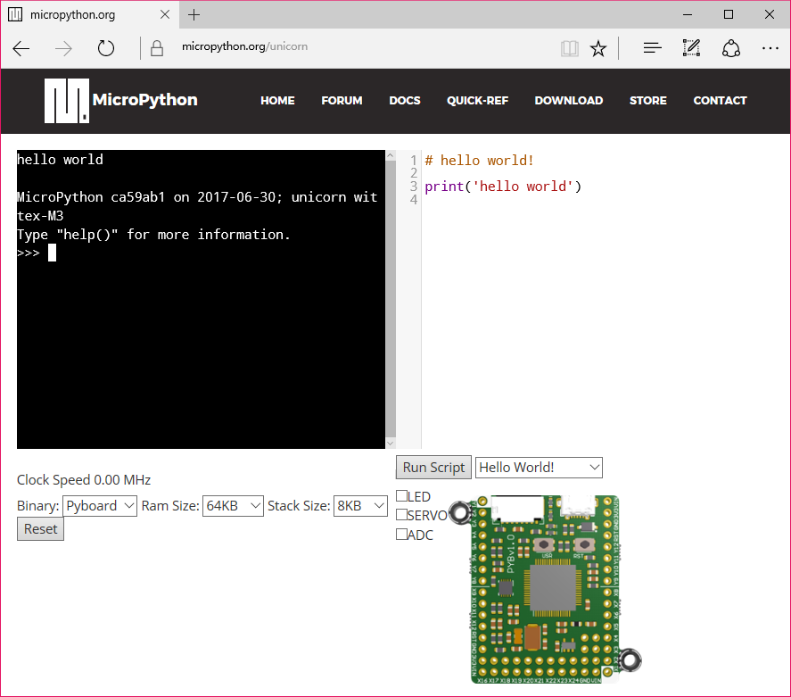
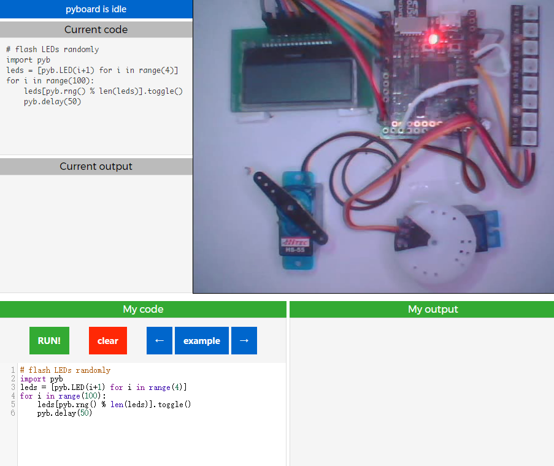
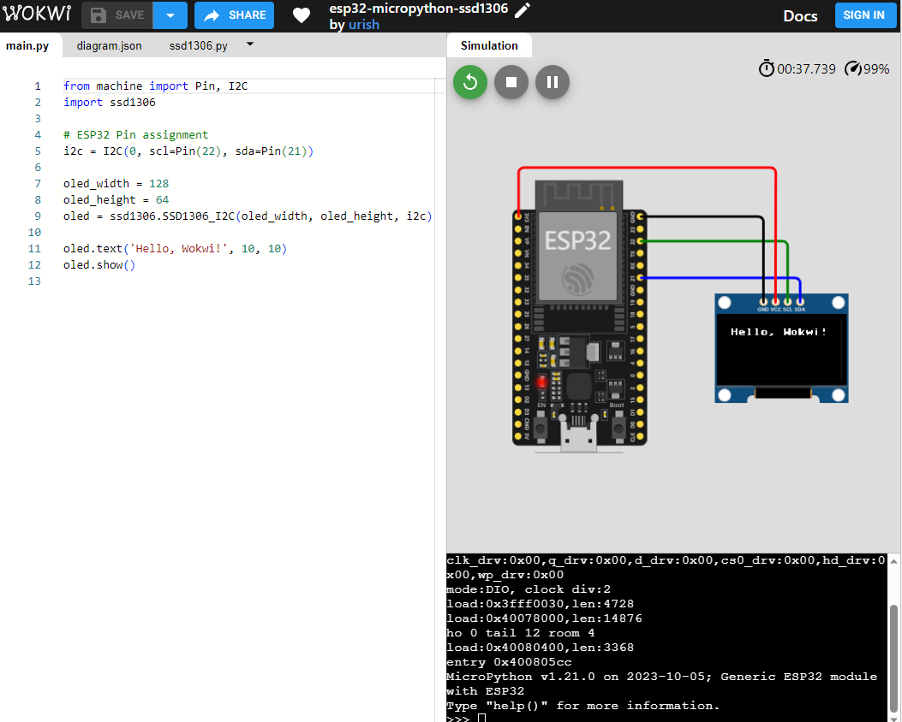
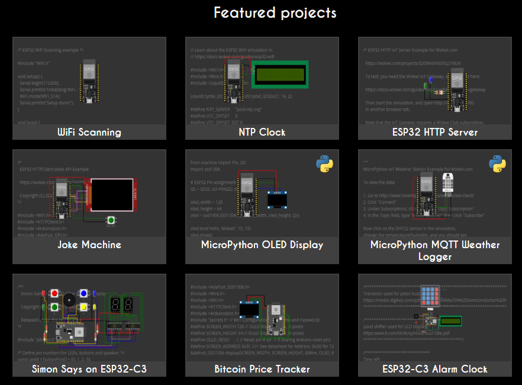

# 模拟运行

在嵌入式软件开发中，软件仿真也是一种常用开发方式，可以在不使用硬件的情况下进行开发，通过计算机软件模拟硬件的功能，快速验证某种算法和功能，提高开发效率。在 MicroPython 中，同样也有软件仿真功能（模拟运行）。

## Unicorn

MicroPython 官方网站上提供了一个在线模拟运行的环境 unicorn，让我们可以通过浏览器去运行和体验 MicroPython。这个在线演示环境可以运行各种例程，查看特定外设和功能模块，如 LED、GPIO、ADC、按键、舵机驱动、延时、数学计算等，可以实时看到 LED 的变化，但是不支持 I2C、SPI、UART、定时器等硬件功能，因为这个在线演示实际上是通过 QEMU 软件进行模拟的，并不是在真正开发板上运行，所以不能完全真实模拟硬件所有功能。

* 在线仿真运行网址：https://micropython.org/unicorn
* unicorn 的源码：https://github.com/micropython/micropython-unicorn

早期的在线演示（http://micropython.org/live/) 是在真正开发板上运行的（这个在线演示现在仍然可以使用），但是访问速度很慢，因为只有一个开发板，一次只能有一个用户访问，但可能会有很多用户排队访问，同时还会受到网速的限制。它连接到一个 PYB V10 开发板上，并连接到舵机、液晶、WS2812 等模块，通过摄像头将运行情况拍摄回来。如果有多人同时访问，会建立访问队列，依次进行使用。

## wokwi

除了 micropython 官方提供的模拟运行环境，还有一个不错的第三方在线模拟运行环 境 wokwi（ 它 的 官 网 地 址 是 https://wokwi.com/） 。 wokwi 可 以 模 拟 运 行STM32、ESP32、Pi Pico、Arduino 等硬件，并且提供了众多的外设和非常绚丽的可视化模拟运行效果，可以逼真的模拟 WS2812、OLED、1602 液晶、数码管、旋钮、RTC、温湿度传感器等多种电子元件。它最早是 arduino 的在线模拟器，现在也支持rust、micropython 的模拟运行功能。wokwi 在浏览器左边编写代码，右边的画布中添加元件，通过鼠标就可以拖拉导线和元件，改变颜色和方向，鼠标滚轮缩放画布。能够随时在左边的代码区修改程序，然后马上看到效果，比在真正的开发板上还快捷方便。

注意第一次运行时可能会比较慢，这与网络有一定关系，因为浏览器需要先在后台下载和缓存一些程序。如果长时间还没有开始运行，可以尝试刷新页面，重新加载程序。

wokwi 带有丰富的 arduino、C、micropython 例程，用户之间也可以共享或者分享自己的程序。注意只有带有 python logo 标志的程序才是 micropython 程序。

## proteus

从 proteus 8.17 sp4  开始，增加了 micropython 仿真的 VSM 模块，利用 proteus 丰富的元件库，可以仿真部分micropython 功能，这极大方便了 micropython 的开发。

* https://github.com/shaoziyang/proteus-program-for-micropython
* https://gitee.com/shaoziyang/proteus-program-for-micropython
* [proteus 仿真效果演示](proteus/readme.md)

## 其它

- [Python 中的 RISC-V 模拟器](riscv-python/readme.md)