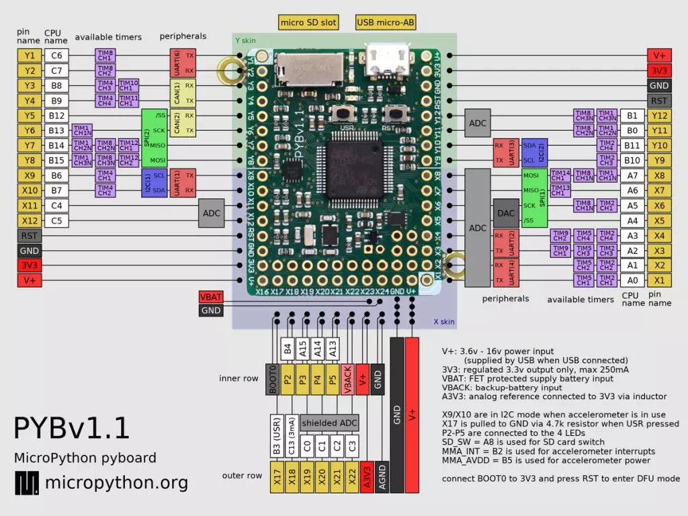

# Pyboard 快速使用教程


- [General board control](#General)
- [Delay and timing](#Delay)
- [Internal LEDs](#LEDs)
- [Internal switch](#Switch)
- [Pins and GPIO](#Pins)
- [Servo control](#Servo)
- [External interrupts](#Externalinterrupts)
- [Timer](#Timer)
- [RTC](#RTC)
- [PWM](#PWM)
- [ADC](#ADC)
- [DAC](#DAC)
- [UART](#UART)
- [SPI](#SPI)
- [I2C](#I2C)
- [I2S](#I2S)
- [CAN bus](#CANbus)
- [Internal accelerometer](#ACC)

* * *

### <a name='General'>General board control</a>
通用控制
```py
import pyb

pyb.repl_uart(pyb.UART(1, 9600)) # duplicate REPL on UART(1)
pyb.wfi() # pause CPU, waiting for interrupt
pyb.freq() # get CPU and bus frequencies
pyb.freq(60000000) # set CPU freq to 60MHz
pyb.stop() # stop CPU, waiting for external interrupt
```

### <a name='Delay'>Delay and timing</a>
延时
```py
import time

time.sleep(1)           # sleep for 1 second
time.sleep_ms(500)      # sleep for 500 milliseconds
time.sleep_us(10)       # sleep for 10 microseconds
start = time.ticks_ms() # get value of millisecond counter
delta = time.ticks_diff(time.ticks_ms(), start) # compute time difference
```

### <a name='LEDs'>Internal LEDs</a>
内部LED
```py
from pyb import LED

led = LED(1) # 1=red, 2=green, 3=yellow, 4=blue
led.toggle()
led.on()
led.off()

# LEDs 3 and 4 support PWM intensity (0-255)
LED(4).intensity()    # get intensity
LED(4).intensity(128) # set intensity to half
```

### <a name='Switch'>Internal switch</a>
内部按键
```py
from pyb import Switch

sw = Switch()
sw.value() # returns True or False
sw.callback(lambda: pyb.LED(1).toggle())
```

### <a name='Pins'>Pins and GPIO</a>
引脚
```py
from pyb import Pin

p_out = Pin('X1', Pin.OUT_PP)
p_out.high()
p_out.low()

p_in = Pin('X2', Pin.IN, Pin.PULL_UP)
p_in.value() # get value, 0 or 1
```

### <a name='Servo'>Servo control</a>
舵机控制
```py
from pyb import Servo

s1 = Servo(1) # servo on position 1 (X1, VIN, GND)
s1.angle(45) # move to 45 degrees
s1.angle(-60, 1500) # move to -60 degrees in 1500ms
s1.speed(50) # for continuous rotation servos
```

### <a name='Externalinterrupts'>External interrupts</a>
外中断
```py
from pyb import Pin, ExtInt

callback = lambda e: print("intr")
ext = ExtInt(Pin('Y1'), ExtInt.IRQ_RISING, Pin.PULL_NONE, callback)
```

### <a name='Timer'>Timer</a>
定时器
```py
from pyb import Timer

tim = Timer(1, freq=1000)
tim.counter() # get counter value
tim.freq(0.5) # 0.5 Hz
tim.callback(lambda t: pyb.LED(1).toggle())
```

### <a name='RTC'>RTC (real time clock)</a>
```py
from pyb import RTC

rtc = RTC()
rtc.datetime((2017, 8, 23, 1, 12, 48, 0, 0)) # set a specific date and time
rtc.datetime() # get date and time
```

### <a name='PWM'>PWM (pulse width modulation)</a>
```py
from pyb import Pin, Timer

p = Pin('X1') # X1 has TIM2, CH1
tim = Timer(2, freq=1000)
ch = tim.channel(1, Timer.PWM, pin=p)
ch.pulse_width_percent(50)
```

### <a name='ADC'>ADC (analog to digital conversion)</a>
```py
from pyb import Pin, ADC

adc = ADC(Pin('X19'))
adc.read() # read value, 0-4095
```

### <a name='DAC'>DAC (digital to analog conversion)</a>
```py
from pyb import Pin, DAC

dac = DAC(Pin('X5'))
dac.write(120) # output between 0 and 255
```

### <a name='UART'>UART (serial bus)</a>
```py
from pyb import UART

uart = UART(1, 9600)
uart.write('hello')
uart.read(5) # read up to 5 bytes
```

### <a name='SPI'>SPI</a>
```py
from pyb import SPI

spi = SPI(1, SPI.CONTROLLER, baudrate=200000, polarity=1, phase=0)
spi.send('hello')
spi.recv(5) # receive 5 bytes on the bus
spi.send_recv('hello') # send and receive 5 bytes
```

### <a name='I2C'>I2C</a>
```py
from machine import I2C

i2c = I2C('X', freq=400000)                 # create hardware I2c object
i2c = I2C(scl='X1', sda='X2', freq=100000)  # create software I2C object

i2c.scan()                          # returns list of peripheral addresses
i2c.writeto(0x42, 'hello')          # write 5 bytes to peripheral with address 0x42
i2c.readfrom(0x42, 5)               # read 5 bytes from peripheral

i2c.readfrom_mem(0x42, 0x10, 2)     # read 2 bytes from peripheral 0x42, peripheral memory 0x10
i2c.writeto_mem(0x42, 0x10, 'xy')   # write 2 bytes to peripheral 0x42, peripheral memory 0x10
```

### <a name='I2S'>I2S</a>
```py
from machine import I2S, Pin

i2s = I2S(2, sck=Pin('Y6'), ws=Pin('Y5'), sd=Pin('Y8'), mode=I2S.TX, bits=16, format=I2S.STEREO, rate=44100, ibuf=40000) # create I2S object
i2s.write(buf)             # write buffer of audio samples to I2S device

i2s = I2S(1, sck=Pin('X5'), ws=Pin('X6'), sd=Pin('Y4'), mode=I2S.RX, bits=16, format=I2S.MONO, rate=22050, ibuf=40000) # create I2S object
i2s.readinto(buf)          # fill buffer with audio samples from I2S device
```

### <a name='CANbus'>CAN bus (controller area network)</a>
```py
from pyb import CAN

can = CAN(1, CAN.LOOPBACK)
can.setfilter(0, CAN.LIST16, 0, (123, 124, 125, 126))
can.send('message!', 123)   # send a message with id 123
can.recv(0)                 # receive message on FIFO 0
```

### <a name='ACC'>Internal accelerometer</a>
板载加速度传感器
```py
from pyb import Accel

accel = Accel()
print(accel.x(), accel.y(), accel.z(), accel.tilt())
```
