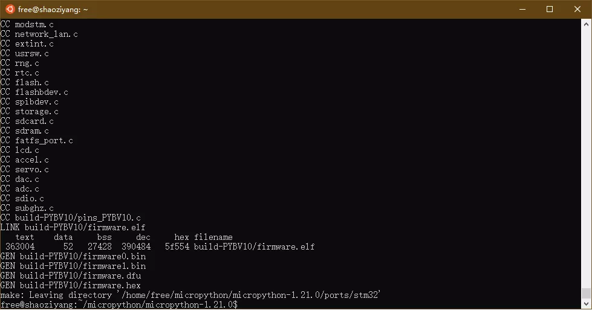

# 编译stm32源码   
进入micropython的源码根目录（如果是zip方式下载，还需要进入和版本相关的一级目录），先编译生成mpy-cross这个内部工具，它也是用来产生mpy文件的软件。   
```
cd micropython
make -C mpy-cross
```
   
编译时，可以使用编译指令（-j4）以多线程方式同时编译多个文件加快速度，-j后面的数字就是线程数，数字不是越大越快，通常计算机的CPU有多少个内核（线程）就可以将线程数设置为多大，如果CPU有8个线程就可以设置为 -j8.   
```
make -C mpy-cross -j8
```
   
使用git下载时，每次大版本更新后，最好先清理一下旧版本编译产生的中间文件，重新进行一次干净的编译，以避免局部更新未生效造成错误，方法是在make的最后加上 clean 选项，如：   
```
make -C mpy-cross clean
```
   
生成mpy-cross后，就可以开始编译stm32的源码了（如果是git方式管理源码，请确认已经通过 `git submodule update —init` 成功拉取了子模块，如果在编译时再去拉取就会非常影响效率）。使用下面的命令就可以编译stm32的源码。   
```
make -C ports/stm32 -j8
```
   
如果前面设置没有错误，就会成功产生micropython固件，包括bin、hex和dfu三种格式（其中bin是分为两个文件，需要一起写入芯片，这一点没有hex/dfu格式方便）。如果编译时出错，往往是没有通过git成功拉取所有第三方模块或者编译需要的工具链没有完整安装。   
   
    
   
上面命令编译出来的是pybv10开发板的固件，如果需要编译其它开发板的固件，需要在编译时使用 BOARD 选项指定开发板，如 NUCLEO-F411RE开发板：   
```
make -C ports/stm32 BOARD=NUCLEO_F411RE -j8
```
   
注意 BOARD后的等号前后都不能有空格。源码中包含了数十种常见的STM32开发板，这些开发板的定义在 `ports/stm32/boards`目录下，编译时开发板的名称其实就是这些开发板所在的目录名。如果要添加源码中没有的开发板，可以参考源码中这些开发板的定义，创建一个新的目录，找一个类似开发板的定义进行修改，加入自定义的内容，就能够编译出自定义的固件。   
   
编译后的固件，会保存到`ports/stm32/build-xxx`（xxx就是BOARD中指定的开发板名称）目录中，将其中的`firmware.hex/firmware.dfu`复制出来，方便以后写入芯片。文件名最好改成和开发板相关并带有版本号容易记忆的名称，避免时间长了将不同的固件混淆难以分辨。   
   
nrf、samd、imxrt系列芯片的编译方法和stm32基本是一样的，因为它们都是 arm 内核，使用相同的工具链。   
   

