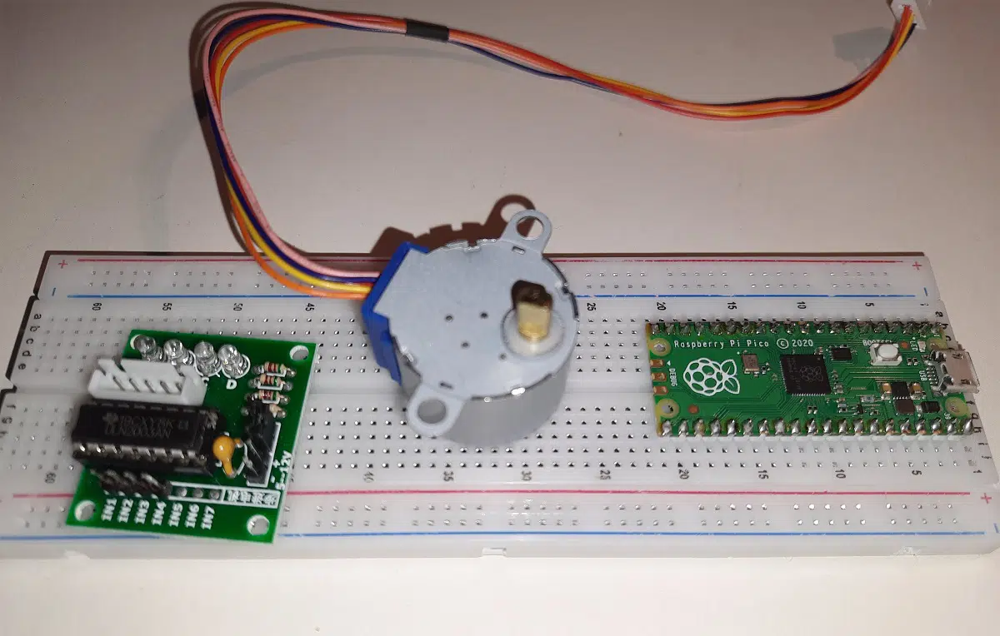

# rp2: 步进电机驱动

用 Raspberry PI Pico 连接和使用 28BYJ-48 和 ULN2003，用 MicroPython 编程。

- [完整说明](https://peppe8o.com/stepper-motor-with-raspberry-pi-pico-28byj-48-and-uln2003-wiring-and-micropython-code/)
- [代码](https://peppe8o.com/download/micropython/stepper-motor/picoStepper.py)
