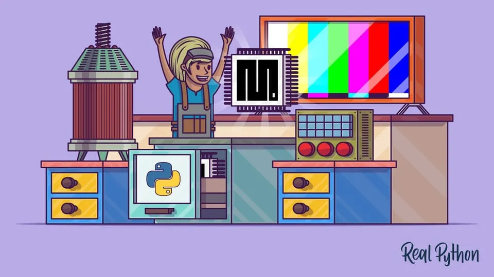

# Python编程硬件入门

你对物联网、家庭自动化和设备互联感兴趣吗？你是否曾想过，自己动手制作一个爆炸装置、一把激光剑，甚至是机器人会是什么感觉？如果是这样，那你很幸运！MicroPython可以帮助你实现这些以及更多的事情。

在本教程中，您将了解到：
- MicroPython的历史
- MicroPython与其他编程语言之间的差异
- 用来构建设备的硬件
- 搭建、编写代码并部署你自己的MicroPython项目的流程

https://realpython.com/micropython/#setting-up-micropython-on-your-board 
