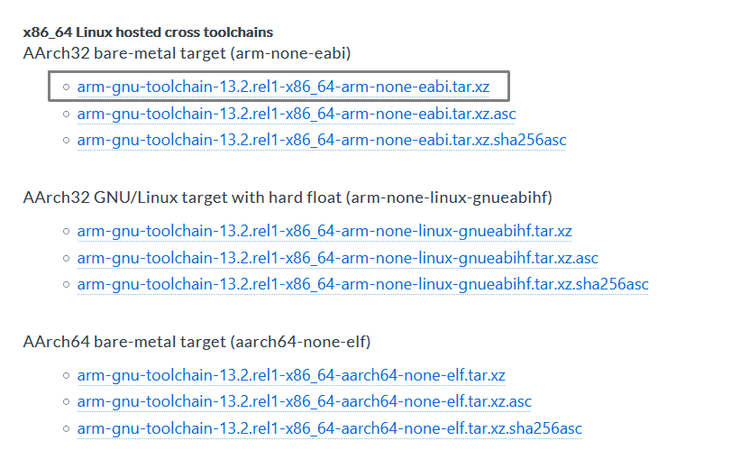

# 安装编译需要的软件

首先需要安装这几个基本软件：gcc、python3、make、git、Arm GNU Toolchain，这是编译需要的基础环境。gcc、python3、make、git等可以通过包管理器直接安装（输入命令时注意区别大小写，以及不同Linux的包管理器不同）：

```
sudo apt install gcc python3 make git
```

Arm GNU Toolchain的安装要稍微复杂一点，因为ubuntu/debian软件仓库中软件的版本比较低，所以我们需要到arm公司官网下载它的最新版本，下载地址是：
https://developer.arm.com/downloads/-/arm-gnu-toolchain-downloads

软件有多个不同操作系统和选项的版本，通常我们需要下载X86_64 Linux中标有arm-none-eabi的那个版本。注意每个版本都有三个文件，只有第一个扩展名是xz的那个才是需要的文件，后面两个是为了保证下载的文件不被篡改的校验文件。



可以使用浏览器或任何下载工具下载文件，如用Linux自带的curl和wget工具。如：
```
curl -L -o arm-gnu-toolchain.tar.xz  https://developer.arm.com/-/media/Files/downloads/gnu/13.2.rel1/binrel/arm-gnu-toolchain-13.2.rel1-x86_64-arm-none-eabi.tar.xz?rev=e434b9ea4afc4ed7998329566b764309&hash=CA590209F5774EE1C96E6450E14A3E26
```

下载链接非常长，输入很容易输错，最好用浏览器复制链接后粘贴到命令行中（这里是以13.2版本为例，实际的版本应该会更高）。下载的Arm GNU Toolchain是一个tar.xz格式的压缩文件，我们需要将它解压缩到一个目录，然后再添加arm-gnu-toolchain的bin目录到系统路径，这样就可以在任意目录下使用它。
```
sudo mkdir /opt/gcc-arm-none-eabi
sudo tar vxf ./arm-gnu-toolchain.tar.xz --strip-components=1 -C /opt/gcc-arm-none-eabi
echo 'export PATH=$PATH:/opt/gcc-arm-none-eabi/bin' | sudo tee -a /etc/profile.d/gcc-arm-none-eabi.sh
source /etc/profile
```

完成上述步骤后，输入命令 arm-none-eabi-gcc —version，如果显示出版本号就说明安装成功。
```
xxxxx@XXXXX:~$ arm-none-eabi-gcc --version
arm-none-eabi-gcc (Arm GNU Toolchain 12.3.Rel1 (Build arm-12.35)) 12.3.1 20230626
Copyright (C) 2022 Free Software Foundation, Inc.
This is free software; see the source for copying conditions.  There is NO
warranty; not even for MERCHANTABILITY or FITNESS FOR A PARTICULAR PURPOSE.
```